# Proto Protocol -- Data Flows

**Версия:** 1.0
**Статус:** Draft

**Связанные документы:** [Roadmap](Roadmap.md) | [HLD](HLD.md) | [LLD](LLD.md) | [Network Architecture](Network-Architecture.md) | [Network Connectivity](Network-Connectivity.md) | [Infrastructure](Infrastructure.md)

---

## 1. Аутентификация и создание сессии

### 1.1 Первичное подключение (Noise Handshake + Session Creation)

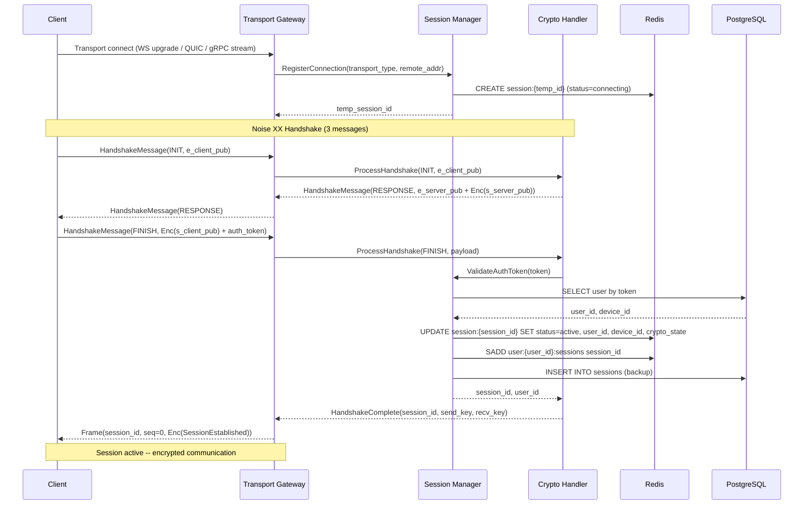

### 1.2 Reconnect (Session Resumption)

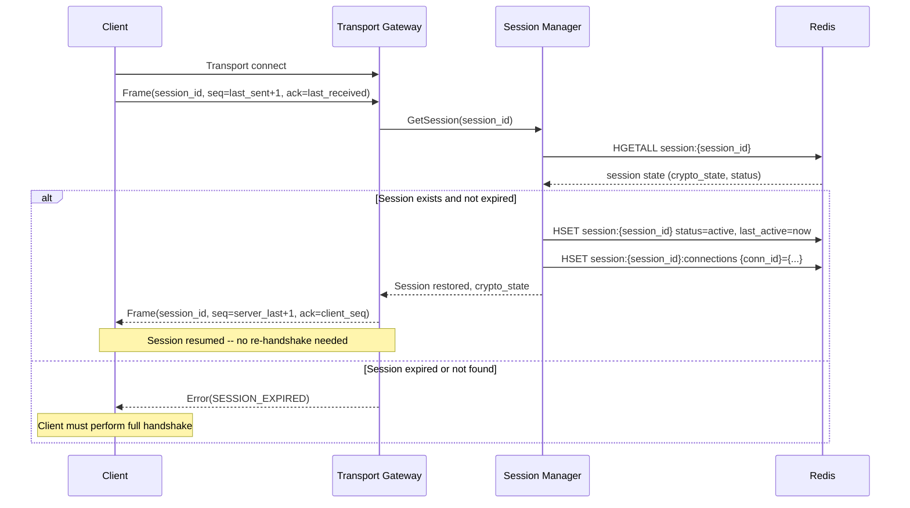

---

## 2. Отправка личного сообщения

### 2.1 Полный путь сообщения (Sender -> Recipient)

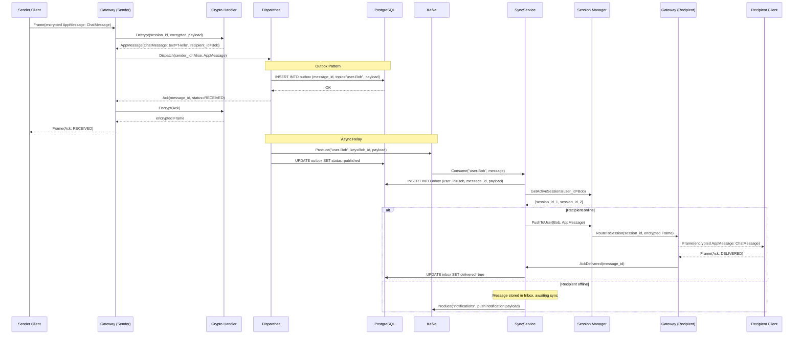

### 2.2 Ack Flow (подтверждение доставки)

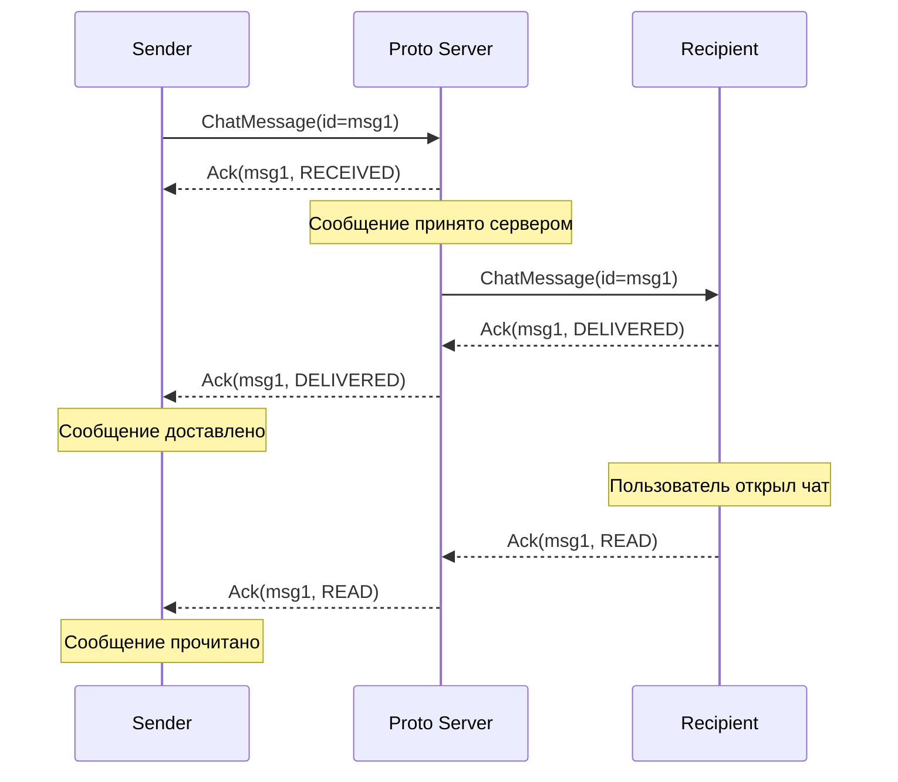

---

## 3. Групповое сообщение с Sender Keys

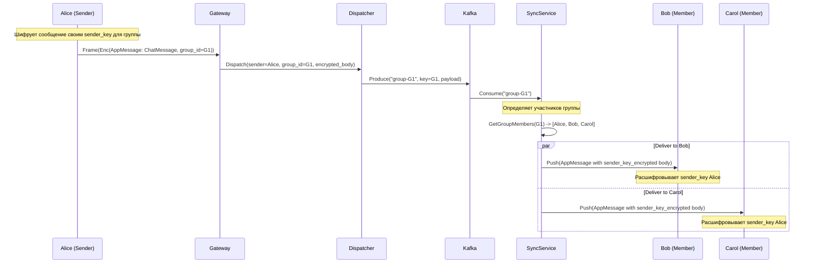

### 3.1 Распространение Sender Key при вступлении

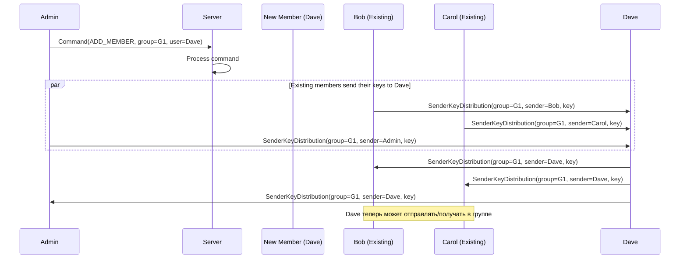

---

## 4. Офлайн-синхронизация

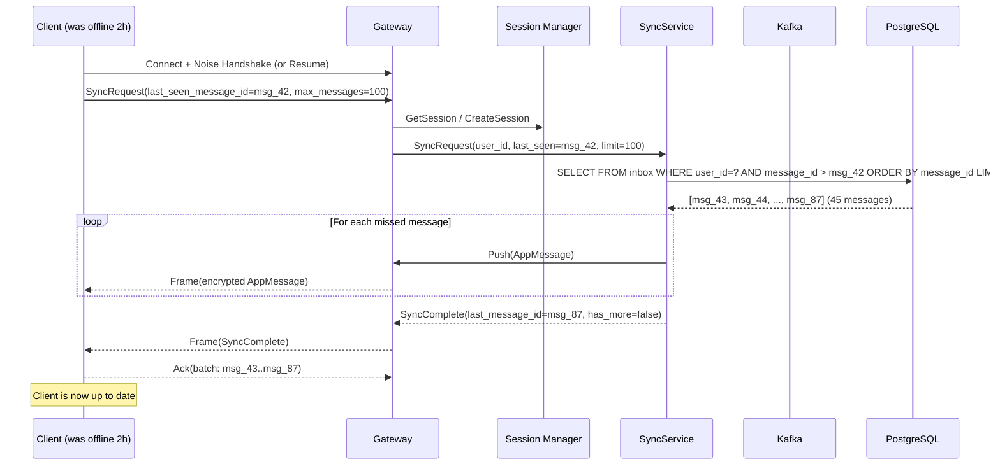

### 4.1 Пагинация при длительном офлайне

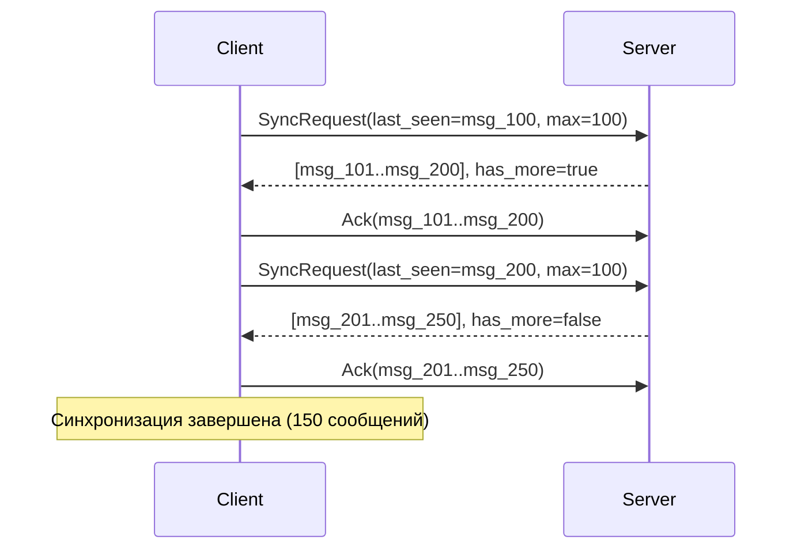

---

## 5. Медиа-загрузка

### 5.1 Chunked Upload Flow

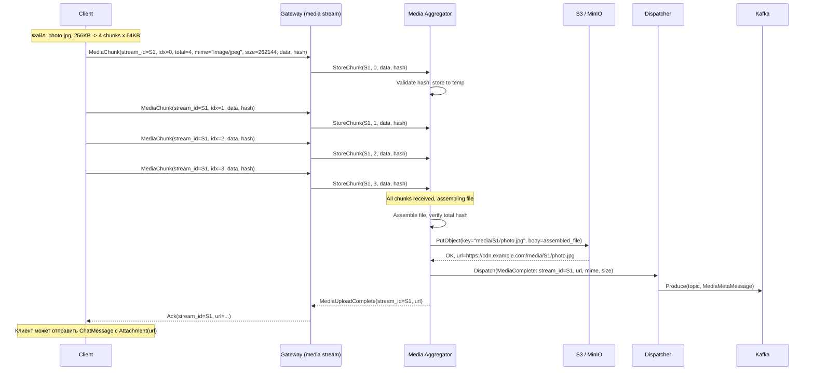

### 5.2 Resume Upload (при потере соединения)

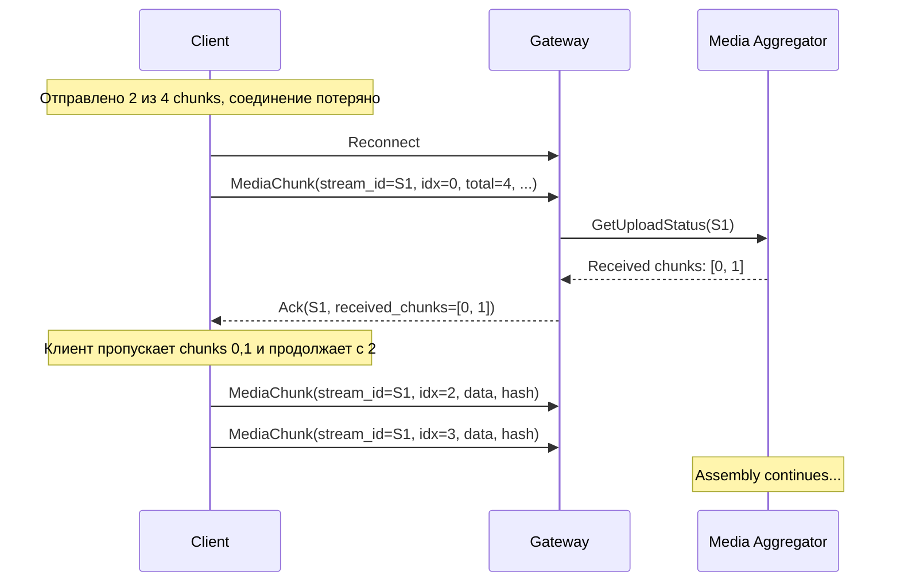

---

## 6. Ротация ключей

### 6.1 Scheduled Rekey

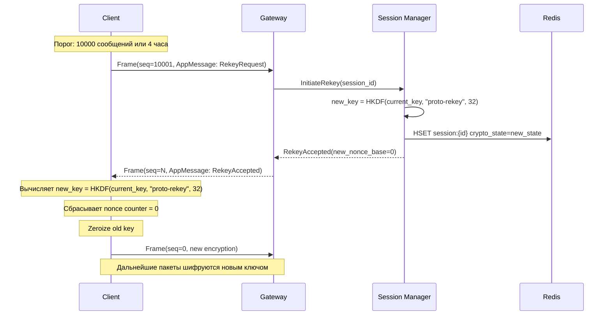

### 6.2 Sender Key Rotation (Group)

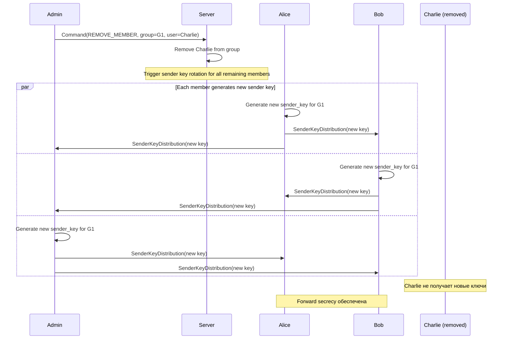

---

## 7. Ping/Pong Keepalive

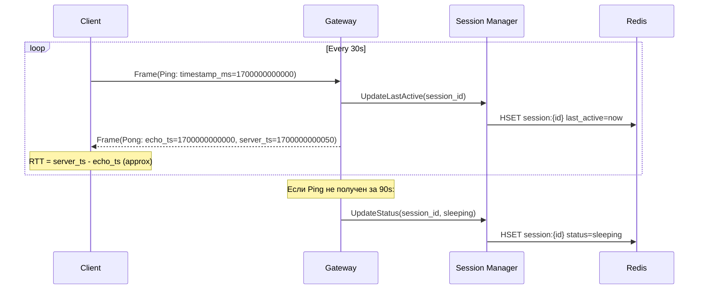

---

## 8. Outbox Relay (асинхронная публикация в Kafka)

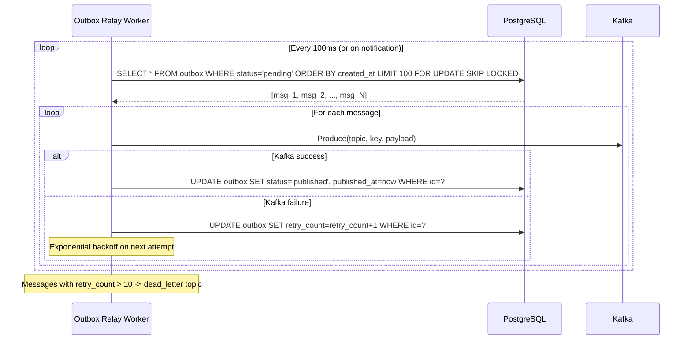

---

## 9. Сводная карта потоков данных

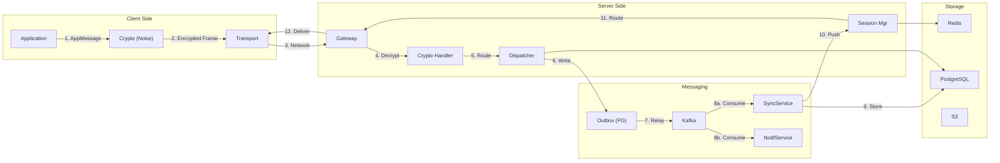
