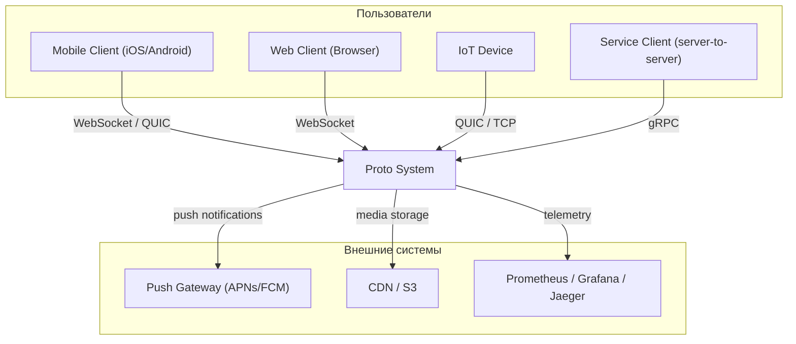
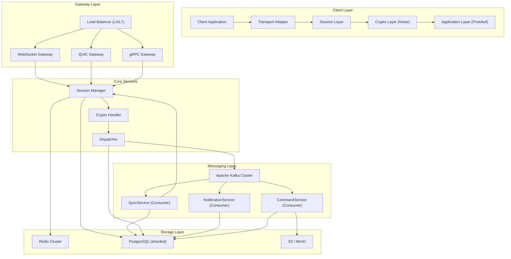
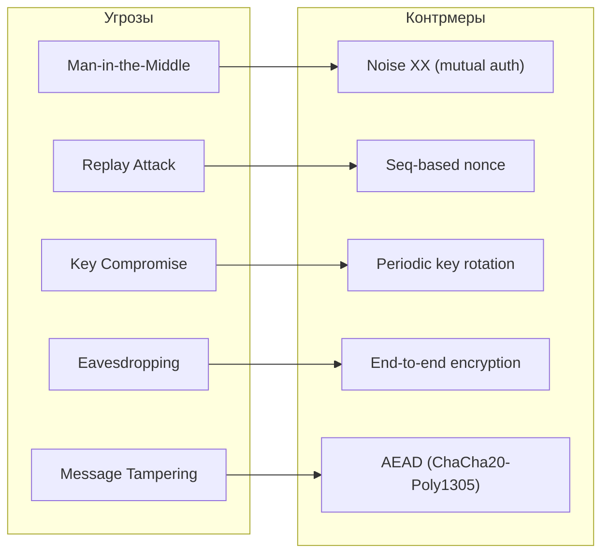
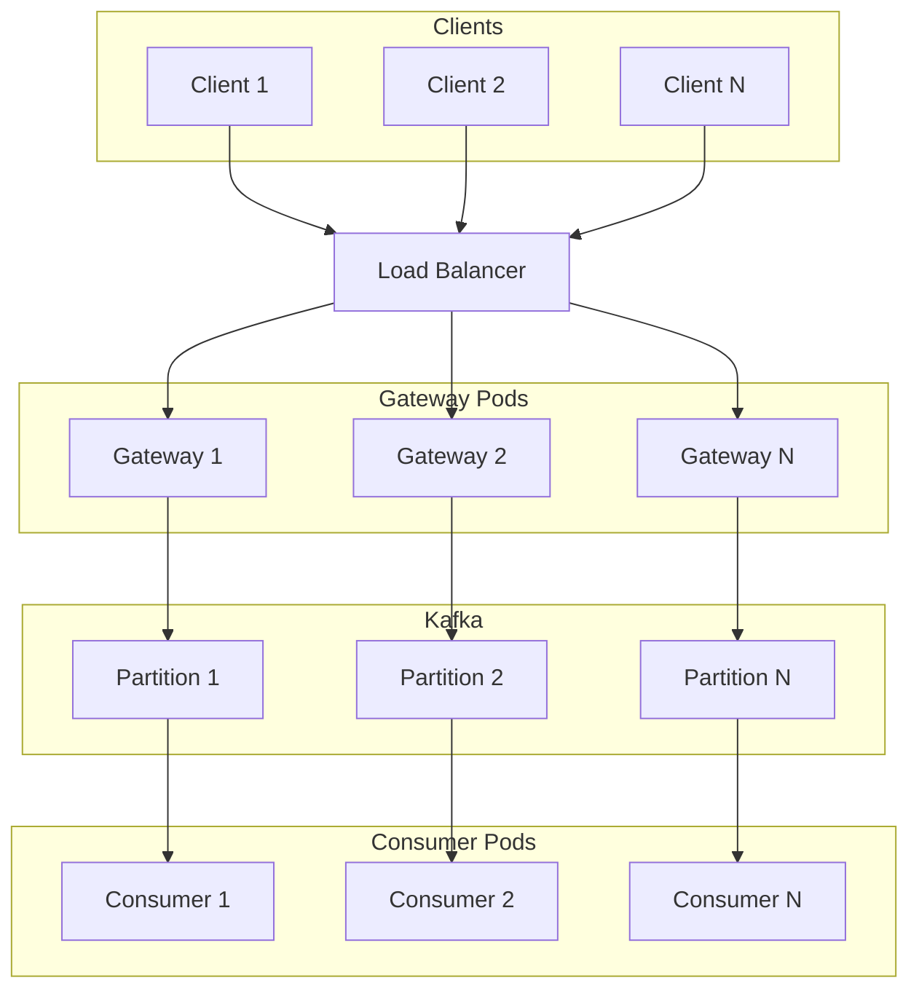

# Proto Protocol -- High-Level Design (HLD)

**Версия:** 1.0
**Статус:** Draft

**Связанные документы:** [Roadmap](Roadmap.md) | [LLD](LLD.md) | [Network Architecture](Network-Architecture.md) | [Data Flows](Data-Flows.md) | [Network Connectivity](Network-Connectivity.md) | [Infrastructure](Infrastructure.md)

---

## 1. Введение

### 1.1 Назначение документа

Данный документ описывает архитектуру верхнего уровня протокола Proto -- транспортно-независимого, криптографически защищённого протокола обмена сообщениями с нативной интеграцией Apache Kafka. Протокол разработан для мессенджера, но спроектирован для переиспользования в IoT, финансовых системах, игровых серверах и системах уведомлений.

### 1.2 Scope

- Архитектура системы (компоненты, взаимодействия)
- Стратегии безопасности, масштабирования, отказоустойчивости
- Технологический стек
- Ограничения и допущения

Детальные спецификации компонентов описаны в [LLD](LLD.md).

---

## 2. Цели и принципы

| Принцип | Описание |
|---------|----------|
| Транспортная независимость | Единый протокол поверх WebSocket, QUIC, gRPC, TCP, SCTP |
| Модульность | Слабая связанность уровней; каждый слой заменяем/расширяем |
| Безопасность по умолчанию | Все соединения шифруются; Noise Protocol, X25519, ChaCha20-Poly1305 |
| Kafka-native | Сообщения естественно отображаются на Kafka-топики; гарантии порядка, идемпотентность |
| Наблюдаемость | Встроенные traces, structured logs, метрики (OpenTelemetry) |
| Переиспользуемость | Ядро (транспорт + сессии + крипто) отделено от бизнес-логики |

---

## 3. Архитектура системы

### 3.1 C4 Context Diagram



### 3.2 C4 Container Diagram



### 3.3 Протокольный стек

```
+--------------------------------------------------+
|          Application Layer (Protobuf)             |
|   ChatMessage | Command | MediaChunk | Ack | Ping |
+--------------------------------------------------+
|          Crypto Layer (Noise Framework)            |
|   Noise_XX | ChaCha20-Poly1305 | X25519 | BLAKE2s |
+--------------------------------------------------+
|          Session Layer                             |
|   session_id | device binding | key rotation       |
+--------------------------------------------------+
|          Transport Layer                           |
|   WebSocket | QUIC | gRPC streaming | TCP          |
+--------------------------------------------------+
```

---

## 4. Обзор компонентов

### 4.1 Transport Gateway

**Назначение:** Приём входящих соединений от клиентов по различным протоколам, маршрутизация на внутренние сервисы.

- Поддерживает WebSocket (WSS/443), QUIC (UDP/443), gRPC (HTTP/2)
- Терминирует TLS (или использует Noise поверх raw-транспорта)
- Управляет пулом соединений на сессию
- Горизонтально масштабируется (stateless, state в Redis)

### 4.2 Session Manager

**Назначение:** Управление жизненным циклом сессий, привязка к устройствам, хранение состояния.

- Состояние сессии: `connecting` -> `active` -> `sleeping` -> `expired`
- Хранение в Redis (hot path) + PostgreSQL (durability)
- Ключ: `session:<session_id>`, поля: user_id, device_id, crypto_state, connections, timestamps
- Поддержка нескольких соединений на одну сессию

### 4.3 Crypto Handler

**Назначение:** Реализация криптографического протокола Noise, шифрование/дешифрование payload.

- Noise_XX_25519_ChaChaPoly_BLAKE2s для handshake
- ChaCha20-Poly1305 для шифрования данных (96-bit nonce на основе seq)
- Периодическая ротация ключей (rekey) без разрыва сессии
- Sender Keys для группового E2E-шифрования

### 4.4 Dispatcher

**Назначение:** Маршрутизация расшифрованных сообщений в соответствующие Kafka-топики.

- Определение топика: `user-<id>`, `group-<id>`, `commands`, `events`
- Outbox-паттерн: запись в PostgreSQL -> relay в Kafka
- Партиционирование по ключу для гарантии порядка
- Идемпотентный Kafka producer (acks=all)

### 4.5 Kafka Cluster

**Назначение:** Центральная шина сообщений с гарантиями порядка и доставки.

- Топики с партиционированием по user_id / group_id
- Replication factor = 3, min.insync.replicas = 2
- Retention: 30 дней для сообщений, 90 дней для events/audit
- Consumer groups: SyncService, NotificationService, CommandService

### 4.6 Consumer Services

| Сервис | Топики | Назначение |
|--------|--------|-----------|
| SyncService | user-*, group-* | Сохранение в Inbox, доставка онлайн-клиентам |
| NotificationService | user-*, group-* | Push-уведомления (APNs, FCM) |
| CommandService | commands | Обработка административных команд |

### 4.7 Storage Layer

| Хранилище | Назначение | Модель доступа |
|-----------|-----------|---------------|
| Redis Cluster | Состояние сессий (hot path) | Key-value, TTL |
| PostgreSQL (sharded) | Outbox, Inbox, метаданные пользователей/групп | Транзакционный, SQL |
| S3 / MinIO | Медиафайлы (изображения, видео, документы) | Object storage, presigned URLs |

---

## 5. Стратегия безопасности

### 5.1 Модель угроз



### 5.2 Криптографические примитивы

| Компонент | Алгоритм | Назначение |
|-----------|---------|-----------|
| Key Exchange | X25519 (ECDH) | Согласование общего ключа |
| Symmetric Encryption | ChaCha20-Poly1305 | Шифрование + аутентификация данных |
| Hash | BLAKE2s | Хеширование в Noise framework |
| Group E2E | Sender Keys + ratchet | Групповое end-to-end шифрование |
| Signatures (optional) | Ed25519 | Non-repudiation (финансовые сценарии) |

### 5.3 Принципы

- **Zero-trust:** каждое соединение аутентифицируется через Noise handshake
- **Forward secrecy:** эфемерные ключи в handshake; периодическая ротация session keys
- **Post-compromise security:** ротация Sender Keys при изменении состава группы
- **Defense in depth:** TLS на транспорте + Noise encryption на уровне протокола

---

## 6. Стратегия масштабирования

### 6.1 Горизонтальное масштабирование



### 6.2 Масштабирование компонентов

| Компонент | Стратегия | Ограничение |
|-----------|----------|-------------|
| Transport Gateway | Horizontal pod autoscaling | Stateless; ограничен кол-вом TCP-соединений на pod |
| Session Manager | Sharded Redis Cluster | Ограничен размером RAM кластера |
| Kafka | Увеличение партиций + брокеров | Партиции -- единица параллелизма |
| SyncService | Consumer group scaling (pods = partitions) | Кол-во pods <= кол-во партиций |
| PostgreSQL | Read replicas + sharding (по user_id) | Write throughput ограничен primary |
| S3 | Бесконечно масштабируется | Стоимость |

### 6.3 Целевые показатели

| Метрика | Target |
|---------|--------|
| Concurrent connections | 1M+ |
| Messages/sec (throughput) | 500K+ |
| End-to-end latency (p99) | < 100ms |
| Handshake latency | < 50ms |
| Availability | 99.95% |

---

## 7. Стратегия отказоустойчивости

| Сценарий отказа | Поведение | Recovery |
|----------------|-----------|---------|
| Gateway pod crash | LB перенаправляет; клиент reconnect | Автоматически; сессия в Redis |
| Redis node failure | Redis Sentinel / Cluster failover | Автоматический failover < 30s |
| PostgreSQL primary failure | Promote replica | Ручной / автоматический (Patroni) |
| Kafka broker failure | ISR replicas принимают лидерство | Автоматически; acks=all гарантирует durability |
| Network partition (Gateway <-> Kafka) | Outbox буферизует; retry при recovery | Автоматически; at-least-once |
| Full Kafka cluster failure | Outbox сохраняет все сообщения | Manual recovery; replay из Outbox |

---

## 8. Технологический стек

### 8.1 Серверная сторона

| Категория | Технология | Обоснование |
|-----------|-----------|-------------|
| Язык | Go (primary) / Rust (crypto-critical) | Производительность, экосистема |
| WebSocket | gorilla/websocket | De-facto стандарт для Go |
| QUIC | quic-go | Зрелая реализация QUIC для Go |
| gRPC | grpc-go | Стандартная библиотека |
| Noise | flynn/noise | Полная реализация Noise для Go |
| Kafka | segmentio/kafka-go | Нативный Go-клиент |
| Serialization | Protocol Buffers (protoc, buf) | Эффективность, строгая типизация |
| Redis | go-redis/redis | Официальный Go-клиент |
| PostgreSQL | pgx | Высокопроизводительный Go-драйвер |
| Observability | OpenTelemetry | Vendor-neutral tracing + metrics |

### 8.2 Клиентские SDK

| Платформа | Язык | Транспорт | Криптография |
|-----------|-----|----------|-------------|
| iOS | Swift | Starscream (WS) | CryptoKit |
| Android | Kotlin | OkHttp (WS) | noise-java |
| Web | TypeScript | Native WebSocket | noise-c.wasm |
| Server | Go | gRPC / QUIC | flynn/noise |

---

## 9. Ограничения и допущения

### 9.1 Ограничения

- Максимальный размер одного Frame.encrypted_payload: 64 KB (медиа передаётся через чанкинг)
- Количество одновременных соединений на одну сессию: до 5
- Группы: до 1000 участников (ограничение Sender Keys)
- Retention сообщений в Kafka: 30 дней (настраивается)

### 9.2 Допущения

- Все клиенты поддерживают X25519 и ChaCha20-Poly1305
- Сетевая связность между компонентами внутри кластера стабильна (< 1ms latency)
- Kafka-кластер развёрнут в той же зоне доступности, что и серверные компоненты
- DNS-резолвинг работает корректно (для service discovery)

---

## 10. Глоссарий

| Термин | Определение |
|--------|-----------|
| Frame | Транспортный пакет протокола Proto (session_id, seq, ack, encrypted_payload) |
| Noise_XX | Двусторонний аутентификационный паттерн Noise Protocol Framework |
| Sender Keys | Протокол группового E2E-шифрования (аналог Signal) |
| Outbox | Паттерн надёжной публикации: запись в БД перед отправкой в Kafka |
| Inbox | Хранилище доставленных сообщений для получателя |
| Dispatcher | Компонент маршрутизации сообщений в Kafka-топики |
| SyncService | Consumer-сервис, отвечающий за доставку сообщений онлайн-клиентам |
| Rekey | Обновление ключей шифрования без разрыва сессии |
