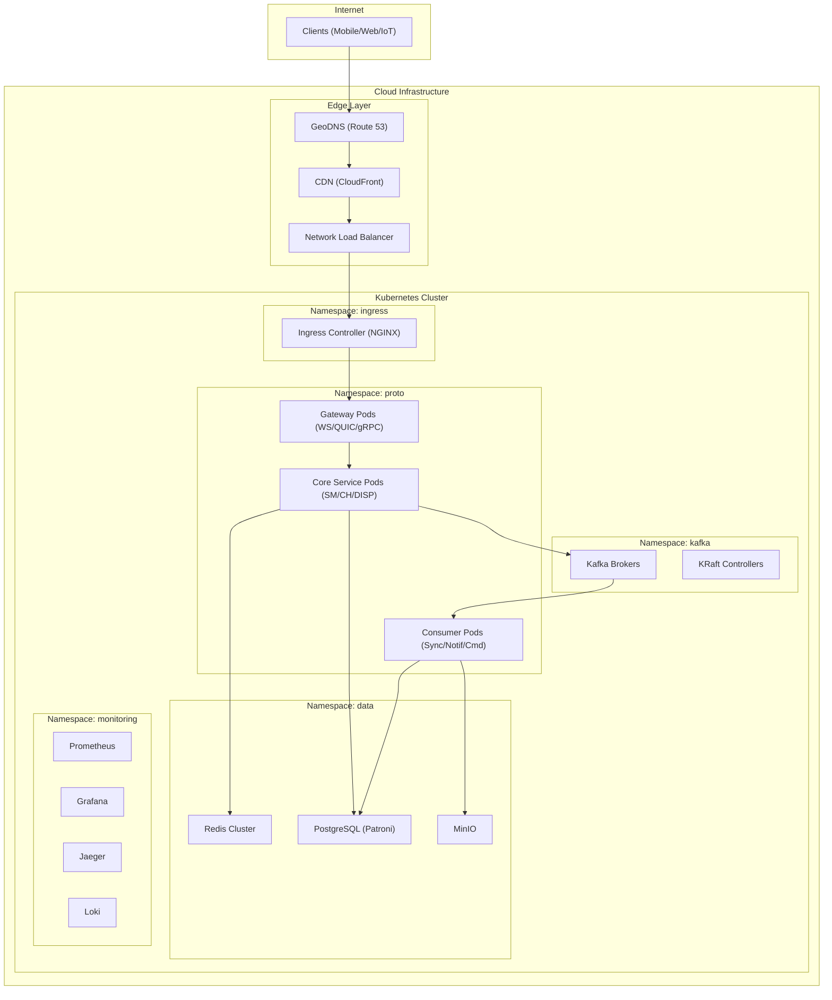
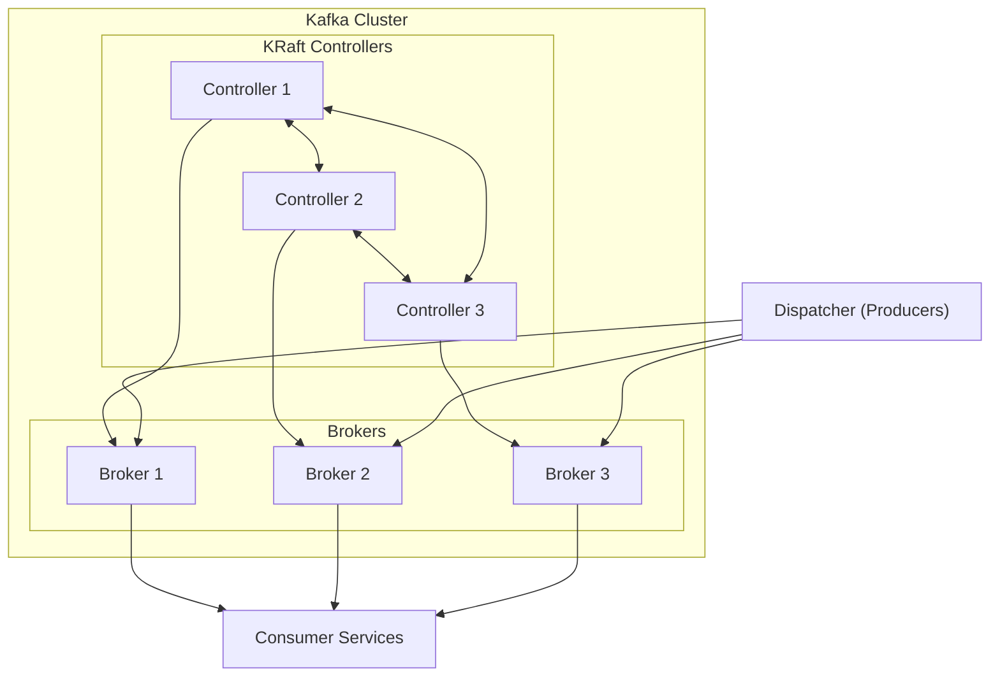
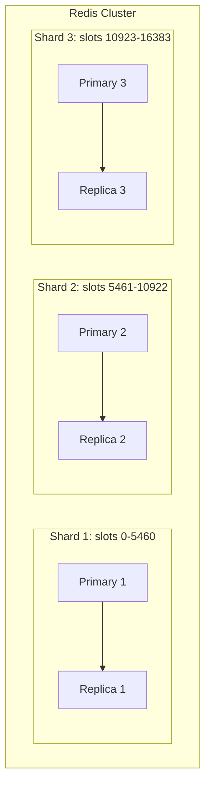
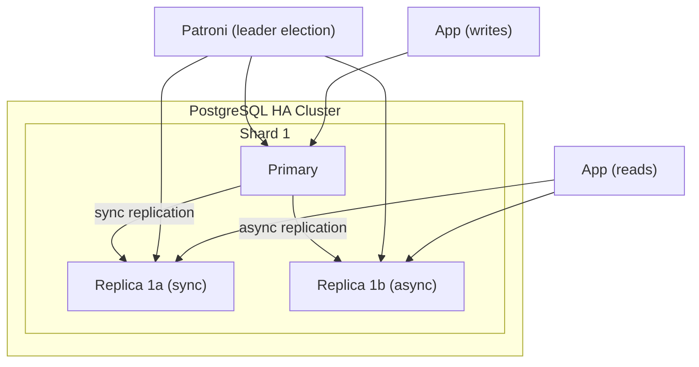
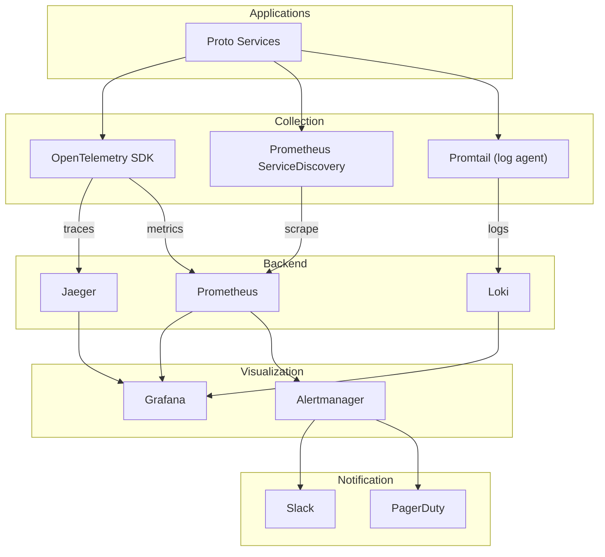

# Proto Protocol -- Infrastructure

**Версия:** 1.0
**Статус:** Draft

**Связанные документы:** [Roadmap](Roadmap.md) | [HLD](HLD.md) | [LLD](LLD.md) | [Network Architecture](Network-Architecture.md) | [Data Flows](Data-Flows.md) | [Network Connectivity](Network-Connectivity.md)

---

## 1. Обзор инфраструктуры

### 1.1 Среды развертывания

| Среда | Назначение | Kubernetes | Масштаб |
|-------|-----------|-----------|---------|
| dev | Локальная разработка | Docker Compose / Minikube | 1 replica всего |
| staging | Интеграционное тестирование | K8s cluster (3 nodes) | Минимальный prod-like |
| prod | Боевая среда | K8s cluster (10+ nodes) | Полный масштаб |

### 1.2 Общая схема инфраструктуры



---

## 2. Kubernetes-архитектура

### 2.1 Namespaces

| Namespace | Содержимое | Ресурсные квоты |
|-----------|-----------|----------------|
| ingress | Ingress Controller (NGINX / Envoy) | CPU: 4 cores, RAM: 8Gi |
| proto | Gateway, Session Manager, Crypto Handler, Dispatcher, Consumers | CPU: 64 cores, RAM: 128Gi |
| kafka | Kafka brokers, KRaft controllers | CPU: 24 cores, RAM: 96Gi |
| data | Redis, PostgreSQL, MinIO | CPU: 32 cores, RAM: 128Gi |
| monitoring | Prometheus, Grafana, Jaeger, Loki | CPU: 16 cores, RAM: 64Gi |

### 2.2 Deployments и StatefulSets

| Компонент | K8s Resource | Replicas (prod) | CPU request | RAM request | Storage |
|-----------|-------------|-----------------|-------------|-------------|---------|
| WS Gateway | Deployment | 4--16 (HPA) | 500m | 512Mi | -- |
| QUIC Gateway | Deployment | 4--16 (HPA) | 500m | 512Mi | -- |
| gRPC Gateway | Deployment | 4--8 (HPA) | 500m | 512Mi | -- |
| Session Manager | Deployment | 3--6 | 1000m | 1Gi | -- |
| Crypto Handler | Deployment | 3--6 | 1000m | 512Mi | -- |
| Dispatcher | Deployment | 3--6 | 500m | 512Mi | -- |
| SyncService | Deployment | 32--128 (HPA) | 250m | 256Mi | -- |
| NotifService | Deployment | 16--64 | 250m | 256Mi | -- |
| CommandService | Deployment | 8--32 | 250m | 256Mi | -- |
| Kafka Broker | StatefulSet | 3--5 | 4000m | 16Gi | 500Gi SSD (PVC) |
| KRaft Controller | StatefulSet | 3 | 500m | 2Gi | 10Gi SSD (PVC) |
| Redis | StatefulSet | 6 (3P+3R) | 2000m | 8Gi | 50Gi SSD (PVC) |
| PostgreSQL | StatefulSet | 3 (1P+2R per shard) | 4000m | 16Gi | 500Gi SSD (PVC) |
| MinIO | StatefulSet | 4 | 2000m | 4Gi | 1Ti HDD (PVC) |
| Prometheus | StatefulSet | 2 | 2000m | 8Gi | 200Gi SSD (PVC) |
| Grafana | Deployment | 2 | 500m | 1Gi | 10Gi (PVC) |
| Jaeger | Deployment | 2 | 1000m | 2Gi | 50Gi SSD (PVC) |
| Loki | StatefulSet | 3 | 1000m | 4Gi | 200Gi SSD (PVC) |

### 2.3 HPA (Horizontal Pod Autoscaler)

```yaml
apiVersion: autoscaling/v2
kind: HorizontalPodAutoscaler
metadata:
  name: ws-gateway
  namespace: proto
spec:
  scaleTargetRef:
    apiVersion: apps/v1
    kind: Deployment
    name: ws-gateway
  minReplicas: 4
  maxReplicas: 16
  metrics:
    - type: Resource
      resource:
        name: cpu
        target:
          type: Utilization
          averageUtilization: 70
    - type: Pods
      pods:
        metric:
          name: active_connections
        target:
          type: AverageValue
          averageValue: "25000"
  behavior:
    scaleUp:
      stabilizationWindowSeconds: 60
      policies:
        - type: Percent
          value: 50
          periodSeconds: 60
    scaleDown:
      stabilizationWindowSeconds: 300
      policies:
        - type: Percent
          value: 25
          periodSeconds: 120
```

### 2.4 Pod Disruption Budget

```yaml
apiVersion: policy/v1
kind: PodDisruptionBudget
metadata:
  name: gateway-pdb
  namespace: proto
spec:
  maxUnavailable: 1
  selector:
    matchLabels:
      app.kubernetes.io/component: gateway
```

### 2.5 Services

| Service | Type | Порты | Примечания |
|---------|------|-------|-----------|
| ws-gateway | ClusterIP | 8080, 8081 (health) | За Ingress Controller |
| quic-gateway | LoadBalancer (UDP) | 8443 | UDP не поддерживается Ingress; прямой LB |
| grpc-gateway | ClusterIP | 8443 | За Ingress Controller (gRPC) |
| session-manager | Headless | 8443 | Client-side load balancing |
| crypto-handler | Headless | 8444 | Client-side load balancing |
| dispatcher | ClusterIP | 8445 | Server-side load balancing |

---

## 3. Kafka-кластер

### 3.1 Архитектура



### 3.2 Конфигурация брокеров

```properties
# KRaft mode
process.roles=broker
controller.quorum.voters=1@kraft-0:9093,2@kraft-1:9093,3@kraft-2:9093

# Networking
listeners=INTERNAL://0.0.0.0:9092,EXTERNAL://0.0.0.0:9093
advertised.listeners=INTERNAL://kafka-{i}.kafka-headless.kafka.svc.cluster.local:9092,EXTERNAL://kafka-{i}.kafka.svc.cluster.local:9093
listener.security.protocol.map=INTERNAL:PLAINTEXT,EXTERNAL:SASL_SSL
inter.broker.listener.name=INTERNAL

# Replication
default.replication.factor=3
min.insync.replicas=2
unclean.leader.election.enable=false

# Storage
log.dirs=/data/kafka
log.retention.hours=720
log.retention.bytes=-1
log.segment.bytes=1073741824
log.cleanup.policy=delete

# Performance
num.io.threads=8
num.network.threads=3
num.partitions=64
socket.send.buffer.bytes=102400
socket.receive.buffer.bytes=102400
socket.request.max.bytes=104857600
```

### 3.3 Топики (создание)

```bash
# User messages -- high throughput, order by user
kafka-topics --create --topic user-messages \
  --partitions 128 --replication-factor 3 \
  --config retention.ms=2592000000 \
  --config min.insync.replicas=2

# Group messages
kafka-topics --create --topic group-messages \
  --partitions 64 --replication-factor 3 \
  --config retention.ms=2592000000

# Commands
kafka-topics --create --topic commands \
  --partitions 32 --replication-factor 3 \
  --config retention.ms=604800000

# Events (audit)
kafka-topics --create --topic events \
  --partitions 64 --replication-factor 3 \
  --config retention.ms=7776000000

# Notifications
kafka-topics --create --topic notifications \
  --partitions 64 --replication-factor 3 \
  --config retention.ms=259200000

# Dead letter queue
kafka-topics --create --topic dead-letter \
  --partitions 8 --replication-factor 3 \
  --config retention.ms=7776000000
```

### 3.4 Мониторинг Kafka

| Метрика | Alert Threshold | Описание |
|---------|----------------|---------|
| kafka_consumer_group_lag | > 10,000 | Consumer отстаёт |
| kafka_broker_under_replicated_partitions | > 0 | Партиции без достаточной репликации |
| kafka_broker_offline_partitions | > 0 | Недоступные партиции |
| kafka_broker_request_latency_p99 | > 100ms | Высокая задержка запросов |
| kafka_broker_disk_usage_percent | > 80% | Диск заполняется |

---

## 4. Redis Cluster

### 4.1 Архитектура



### 4.2 Конфигурация

```
# Cluster mode
cluster-enabled yes
cluster-config-file nodes.conf
cluster-node-timeout 5000
cluster-require-full-coverage no

# Persistence
appendonly yes
appendfsync everysec
auto-aof-rewrite-percentage 100
auto-aof-rewrite-min-size 64mb

# Memory
maxmemory 6gb
maxmemory-policy allkeys-lru

# Performance
tcp-keepalive 300
timeout 0
hz 10
```

### 4.3 Sizing Estimate

| Данные | Размер per entry | Кол-во | Итого RAM |
|--------|-----------------|--------|----------|
| Session state | ~500 bytes | 1M active sessions | ~500 MB |
| Session connections | ~200 bytes per conn | 2M connections | ~400 MB |
| User sessions index | ~50 bytes per entry | 500K users | ~25 MB |
| Rate limiting | ~30 bytes | 500K counters | ~15 MB |
| Sender key cache | ~200 bytes | 100K entries | ~20 MB |
| **Total** | | | **~1 GB** (+ overhead ~2x = 2 GB per shard) |

---

## 5. PostgreSQL

### 5.1 Архитектура (Patroni HA)



### 5.2 Конфигурация

```
# postgresql.conf (key parameters)
max_connections = 200
shared_buffers = 4GB
effective_cache_size = 12GB
work_mem = 64MB
maintenance_work_mem = 512MB

# WAL
wal_level = replica
max_wal_senders = 5
wal_keep_size = 1GB
synchronous_commit = on
synchronous_standby_names = 'replica1'

# Checkpoints
checkpoint_completion_target = 0.9
max_wal_size = 2GB
min_wal_size = 512MB

# Logging
log_min_duration_statement = 100
log_checkpoints = on
log_lock_waits = on

# Performance
random_page_cost = 1.1
effective_io_concurrency = 200
```

### 5.3 Backup

| Параметр | Значение |
|----------|---------|
| Tool | pgBackRest |
| Full backup | Weekly (Sunday 02:00 UTC) |
| Incremental backup | Daily (02:00 UTC) |
| WAL archiving | Continuous (to S3) |
| Retention | 30 days |
| Storage | S3 bucket: `proto-pg-backups` |
| RTO | < 1 hour |
| RPO | < 5 minutes (WAL archiving) |

### 5.4 Шардирование

Для prod с > 10M пользователей:

| Таблица | Стратегия шардирования | Shard Key | Шардов |
|---------|----------------------|-----------|--------|
| sessions | Hash(session_id) | session_id | 4 |
| outbox | Hash(message_id) | message_id | 8 |
| inbox | Hash(user_id) | user_id | 16 |
| groups | Не шардируется | -- | 1 |
| group_members | Не шардируется | -- | 1 |
| media_uploads | Hash(user_id) | user_id | 4 |

Реализация: Citus extension или application-level routing.

---

## 6. S3 / Object Storage

### 6.1 Dev: MinIO

```yaml
# MinIO StatefulSet (dev/staging)
apiVersion: apps/v1
kind: StatefulSet
metadata:
  name: minio
  namespace: minio
spec:
  replicas: 4
  template:
    spec:
      containers:
        - name: minio
          image: minio/minio:latest
          args: ["server", "--console-address", ":9001", "/data"]
          env:
            - name: MINIO_ROOT_USER
              valueFrom:
                secretKeyRef:
                  name: minio-credentials
                  key: access-key
            - name: MINIO_ROOT_PASSWORD
              valueFrom:
                secretKeyRef:
                  name: minio-credentials
                  key: secret-key
          volumeMounts:
            - name: data
              mountPath: /data
  volumeClaimTemplates:
    - metadata:
        name: data
      spec:
        accessModes: ["ReadWriteOnce"]
        resources:
          requests:
            storage: 250Gi
```

### 6.2 Prod: AWS S3

| Параметр | Значение |
|----------|---------|
| Bucket | proto-media-prod |
| Region | us-east-1 (primary) |
| Storage class | S3 Standard (hot), S3 IA (after 30 days), Glacier (after 90 days) |
| Versioning | Enabled |
| Encryption | SSE-S3 (AES-256) |
| Lifecycle | IA after 30d, Glacier after 90d, delete after 365d |
| CORS | Allowed origins: proto.example.com |
| Access | IAM role (IRSA for K8s pods) |
| CDN | CloudFront distribution for downloads |

### 6.3 Buckets

| Bucket | Назначение | Access Pattern |
|--------|-----------|---------------|
| proto-media | Медиафайлы (images, video, docs) | Write: server, Read: presigned URL (CDN) |
| proto-avatars | Аватары пользователей | Write: server, Read: public (CDN, long cache) |
| proto-pg-backups | PostgreSQL backups | Write: pgBackRest, Read: disaster recovery |
| proto-kafka-tiered | Kafka tiered storage (optional) | Write: Kafka, Read: Kafka |

---

## 7. CI/CD Pipeline

### 7.1 Pipeline Overview

```mermaid
graph LR
    subgraph ci[CI]
        Lint["Lint (golangci-lint, protolint)"]
        UnitTest["Unit Tests"]
        Build["Build Binaries"]
        DockerBuild["Docker Build"]
        IntegrationTest["Integration Tests"]
        SecurityScan["Security Scan (trivy)"]
    end

    subgraph cd[CD]
        PushRegistry["Push to Registry"]
        DeployStaging["Deploy to Staging"]
        SmokeTest["Smoke Tests"]
        DeployProd["Deploy to Prod (canary)"]
        CanaryCheck["Canary Health Check"]
        FullRollout["Full Rollout"]
    end

    Lint --> UnitTest
    UnitTest --> Build
    Build --> DockerBuild
    DockerBuild --> IntegrationTest
    IntegrationTest --> SecurityScan
    SecurityScan --> PushRegistry
    PushRegistry --> DeployStaging
    DeployStaging --> SmokeTest
    SmokeTest --> DeployProd
    DeployProd --> CanaryCheck
    CanaryCheck --> FullRollout
```



### 7.2 CI этапы

| Этап | Инструмент | Триггер | Длительность |
|------|-----------|---------|-------------|
| Lint | golangci-lint, protolint, buf lint | Push to any branch | ~2 min |
| Unit Tests | go test ./... -race | Push to any branch | ~5 min |
| Build | go build, buf generate | Push to any branch | ~3 min |
| Docker Build | docker buildx (multi-arch) | Push to main / tag | ~5 min |
| Integration Tests | Docker Compose (Redis, PG, Kafka) + go test -tags=integration | PR to main | ~10 min |
| Security Scan | trivy image scan, gosec | PR to main | ~3 min |
| Protobuf Compatibility | buf breaking --against main | PR to main | ~1 min |

### 7.3 CD этапы

| Этап | Инструмент | Триггер | Стратегия |
|------|-----------|---------|----------|
| Push to Registry | ghcr.io / ECR | Merge to main | Automatic |
| Deploy to Staging | ArgoCD / Flux | Image pushed | GitOps, automatic sync |
| Smoke Tests | k6, custom scripts | Post-deploy hook | 5 min timeout |
| Deploy to Prod | ArgoCD / Flux | Manual approval | Canary (10% -> 50% -> 100%) |
| Canary Health Check | Prometheus alerts | During canary | Error rate < 0.1%, p99 < 100ms |
| Rollback | ArgoCD rollback | Failed health check | Automatic |

### 7.4 Docker Image Strategy

```dockerfile
# Multi-stage build
FROM golang:1.22-alpine AS builder
WORKDIR /app
COPY go.mod go.sum ./
RUN go mod download
COPY . .
RUN CGO_ENABLED=0 go build -ldflags="-s -w" -o /bin/server ./cmd/server

FROM gcr.io/distroless/static:nonroot
COPY --from=builder /bin/server /bin/server
USER nonroot:nonroot
ENTRYPOINT ["/bin/server"]
```

---

## 8. Мониторинг и Observability

### 8.1 Стек мониторинга



### 8.2 Ключевые метрики

| Категория | Метрика | Тип | Labels |
|-----------|--------|-----|--------|
| **Connections** | proto_active_connections | Gauge | transport, gateway_pod |
| | proto_connection_duration_seconds | Histogram | transport |
| | proto_handshake_duration_seconds | Histogram | transport, status |
| **Messages** | proto_messages_sent_total | Counter | type, transport |
| | proto_messages_received_total | Counter | type, transport |
| | proto_message_size_bytes | Histogram | type, direction |
| **Sessions** | proto_active_sessions | Gauge | status |
| | proto_session_duration_seconds | Histogram | -- |
| **Kafka** | proto_kafka_produce_duration_seconds | Histogram | topic |
| | proto_kafka_consume_lag | Gauge | topic, consumer_group, partition |
| **Crypto** | proto_encrypt_duration_seconds | Histogram | -- |
| | proto_decrypt_duration_seconds | Histogram | -- |
| | proto_rekey_total | Counter | -- |
| **Errors** | proto_errors_total | Counter | component, error_type |
| **Media** | proto_media_upload_duration_seconds | Histogram | mime_type |
| | proto_media_upload_size_bytes | Histogram | -- |

### 8.3 Grafana Dashboards

| Dashboard | Содержимое |
|-----------|-----------|
| Proto Overview | Active connections, messages/sec, error rate, p99 latency |
| Gateway Detail | Connections by transport, handshake success rate, bandwidth |
| Kafka Health | Broker status, partition lag, produce/consume throughput |
| Session Manager | Active/sleeping/expired sessions, Redis latency |
| Consumer Pipeline | Consume rate, processing latency, Inbox write rate |
| Infrastructure | Node CPU/RAM, disk I/O, network I/O |

### 8.4 Distributed Tracing

Каждое сообщение получает trace_id, который propagates через все компоненты:

```
trace_id propagation path:
  Client -> Gateway (create trace)
    -> Crypto Handler (span: decrypt)
    -> Dispatcher (span: dispatch)
    -> Kafka (header: traceparent)
    -> SyncService (span: consume)
    -> Session Manager (span: push)
    -> Gateway (span: deliver)
    -> Recipient Client
```

Формат: W3C Trace Context (`traceparent` header).

---

## 9. Логирование

### 9.1 Структура логов (JSON)

```json
{
  "timestamp": "2026-04-01T12:00:00.000Z",
  "level": "info",
  "logger": "gateway.websocket",
  "message": "connection established",
  "trace_id": "abc123def456",
  "span_id": "789xyz",
  "session_id": "sess-uuid-here",
  "user_id": "user-uuid-here",
  "transport": "websocket",
  "remote_addr": "1.2.3.4:5678",
  "gateway_pod": "ws-gateway-abc12"
}
```

### 9.2 Log Levels

| Level | Использование |
|-------|-------------|
| ERROR | Ошибки, требующие внимания (failed handshake, Kafka produce failure, DB error) |
| WARN | Аномалии, не критичные (rate limit hit, slow query, retry) |
| INFO | Ключевые события (connection open/close, session created/expired, message dispatched) |
| DEBUG | Детальная информация для отладки (packet contents, state transitions) -- только в dev/staging |

### 9.3 Retention

| Среда | Retention | Storage |
|-------|----------|---------|
| dev | 3 дня | Local Loki |
| staging | 14 дней | Loki + S3 |
| prod | 30 дней (hot), 90 дней (cold) | Loki + S3 Glacier |

---

## 10. Alerting

### 10.1 Критические алерты (P1 -- немедленная реакция)

| Alert | Условие | Действие |
|-------|---------|---------|
| HighErrorRate | error_rate > 5% за 5 min | PagerDuty + Slack |
| KafkaDown | offline_partitions > 0 за 2 min | PagerDuty + Slack |
| PostgreSQLDown | primary unavailable за 1 min | PagerDuty |
| RedisDown | cluster state != ok за 1 min | PagerDuty |
| HighLatency | p99 > 500ms за 5 min | PagerDuty + Slack |
| NoActiveGateways | active_gateway_pods == 0 | PagerDuty |

### 10.2 Предупреждения (P2 -- реакция в рабочее время)

| Alert | Условие | Действие |
|-------|---------|---------|
| HighConsumerLag | kafka_lag > 10,000 за 10 min | Slack |
| HighCPU | cpu_usage > 80% за 15 min | Slack |
| HighMemory | memory_usage > 85% за 10 min | Slack |
| DiskAlmostFull | disk_usage > 80% | Slack |
| HighRetryRate | outbox_retry_rate > 10% за 5 min | Slack |
| CertExpiringSoon | cert_expiry < 14 days | Slack |
| SlowQueries | pg_slow_queries > 100/min | Slack |

### 10.3 Информационные (P3)

| Alert | Условие | Действие |
|-------|---------|---------|
| DeploymentStarted | new version detected | Slack |
| ScaleUpEvent | HPA scaled up | Slack |
| BackupCompleted | pgBackRest success | Slack (log) |

---

## 11. Dev-окружение (Docker Compose)

```yaml
version: "3.9"
services:
  redis:
    image: redis:7-alpine
    ports: ["6379:6379"]
    command: redis-server --appendonly yes

  postgres:
    image: postgres:16-alpine
    ports: ["5432:5432"]
    environment:
      POSTGRES_DB: proto
      POSTGRES_USER: proto
      POSTGRES_PASSWORD: proto_dev
    volumes:
      - pgdata:/var/lib/postgresql/data

  kafka:
    image: bitnami/kafka:3.7
    ports: ["9092:9092"]
    environment:
      KAFKA_CFG_NODE_ID: 1
      KAFKA_CFG_PROCESS_ROLES: broker,controller
      KAFKA_CFG_CONTROLLER_QUORUM_VOTERS: 1@kafka:9093
      KAFKA_CFG_LISTENERS: PLAINTEXT://:9092,CONTROLLER://:9093
      KAFKA_CFG_ADVERTISED_LISTENERS: PLAINTEXT://localhost:9092
      KAFKA_CFG_CONTROLLER_LISTENER_NAMES: CONTROLLER
      KAFKA_CFG_AUTO_CREATE_TOPICS_ENABLE: "true"
    volumes:
      - kafkadata:/bitnami/kafka

  minio:
    image: minio/minio:latest
    ports: ["9000:9000", "9001:9001"]
    environment:
      MINIO_ROOT_USER: minioadmin
      MINIO_ROOT_PASSWORD: minioadmin
    command: server /data --console-address ":9001"
    volumes:
      - miniodata:/data

  jaeger:
    image: jaegertracing/all-in-one:1.55
    ports:
      - "16686:16686"
      - "14250:14250"
      - "4317:4317"

  prometheus:
    image: prom/prometheus:v2.51.0
    ports: ["9090:9090"]
    volumes:
      - ./deploy/prometheus.yml:/etc/prometheus/prometheus.yml

  grafana:
    image: grafana/grafana:10.4.0
    ports: ["3000:3000"]
    environment:
      GF_SECURITY_ADMIN_PASSWORD: admin

volumes:
  pgdata:
  kafkadata:
  miniodata:
```

---

## 12. Disaster Recovery

### 12.1 RPO / RTO Targets

| Компонент | RPO | RTO | Стратегия |
|-----------|-----|-----|----------|
| Kafka | 0 (acks=all, ISR) | < 5 min (auto failover) | Multi-broker, ISR replication |
| Redis | < 1 sec (AOF everysec) | < 30 sec (Sentinel/Cluster failover) | Cluster mode + AOF |
| PostgreSQL | < 5 min (WAL archiving) | < 1 hour (Patroni failover) | Sync replication + WAL archive to S3 |
| S3 | 0 (managed durability) | N/A (managed) | 11 nines durability (AWS S3) |
| Sessions | < 1 sec | < 30 sec | Redis primary; PG as backup |

### 12.2 Backup Schedule

| Данные | Периодичность | Хранение | Расположение |
|--------|-------------|---------|-------------|
| PostgreSQL (full) | Weekly | 30 дней | S3: proto-pg-backups |
| PostgreSQL (incremental) | Daily | 30 дней | S3: proto-pg-backups |
| PostgreSQL (WAL) | Continuous | 7 дней | S3: proto-pg-backups/wal |
| Redis (RDB snapshot) | Every 6 hours | 7 дней | PVC + S3 |
| Kafka (topic data) | Kafka retention | 30--90 дней | Broker disks |
| Configuration (K8s) | On every change (GitOps) | Git history | Git repository |
