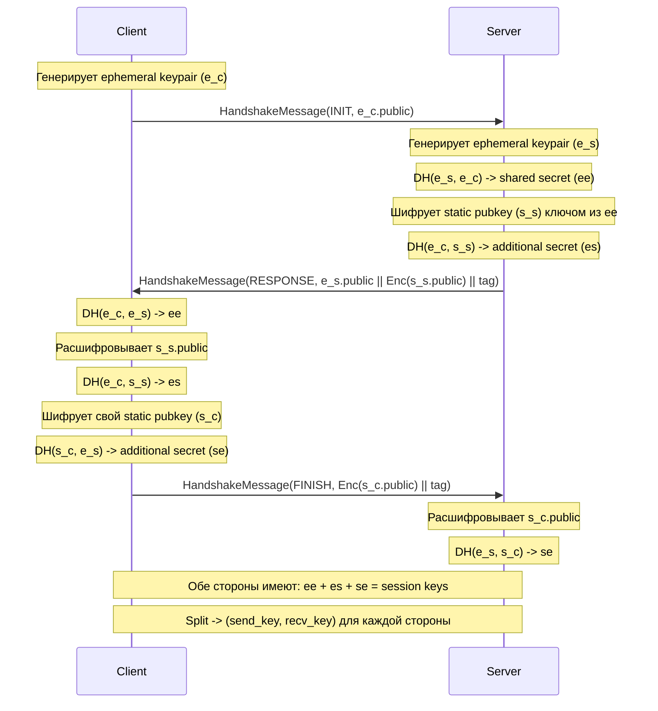
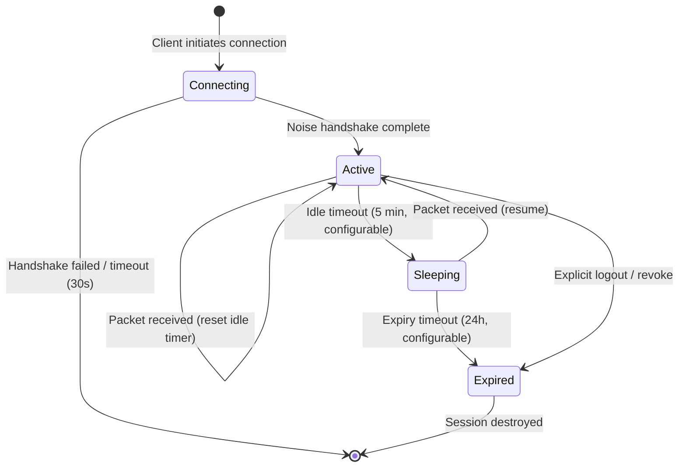

# Proto Protocol -- Low-Level Design (LLD)

**Версия:** 1.0
**Статус:** Draft

**Связанные документы:** [Roadmap](Roadmap.md) | [HLD](HLD.md) | [Network Architecture](Network-Architecture.md) | [Data Flows](Data-Flows.md) | [Network Connectivity](Network-Connectivity.md) | [Infrastructure](Infrastructure.md)

---

## 1. Protobuf-схемы

### 1.1 Транспортный фрейм

```protobuf
syntax = "proto3";
package proto.transport;

message Frame {
  bytes session_id = 1;        // UUID сессии (16 bytes, UUIDv4 или UUIDv7)
  uint64 seq = 2;              // Монотонный номер пакета (отправитель)
  uint64 ack = 3;              // Подтверждение последнего принятого seq
  bytes encrypted_payload = 4; // Зашифрованный AppMessage (ChaCha20-Poly1305)
}

message HandshakeMessage {
  HandshakeType type = 1;
  bytes payload = 2;           // Noise handshake data

  enum HandshakeType {
    HANDSHAKE_TYPE_UNSPECIFIED = 0;
    INIT = 1;                  // -> e (client ephemeral pubkey)
    RESPONSE = 2;              // -> e, ee, s, es (server response)
    FINISH = 3;                // -> s, se (client finish)
  }
}
```

### 1.2 Прикладные сообщения

```protobuf
syntax = "proto3";
package proto.app;

import "google/protobuf/timestamp.proto";

message AppMessage {
  bytes message_id = 1;                    // UUIDv7 (16 bytes, сортировка по времени)
  google.protobuf.Timestamp timestamp = 2;
  oneof body {
    ChatMessage chat = 3;
    Command cmd = 4;
    MediaChunk media = 5;
    Ack ack = 6;
    Ping ping = 7;
    Pong pong = 8;
    SenderKeyDistribution sender_key = 9;
    SyncRequest sync_request = 10;
  }
}

message ChatMessage {
  bytes conversation_id = 1;   // ID чата (1-to-1 или группа)
  bytes sender_id = 2;
  bytes recipient_id = 3;      // Только для 1-to-1; пусто для групп
  bytes group_id = 4;          // Только для групп
  ChatAction action = 5;
  string text = 6;
  bytes reply_to = 7;          // message_id, на который отвечает
  repeated Attachment attachments = 8;

  enum ChatAction {
    CHAT_ACTION_UNSPECIFIED = 0;
    SEND = 1;
    EDIT = 2;
    DELETE = 3;
    REACTION = 4;
  }
}

message Attachment {
  string mime_type = 1;
  string url = 2;              // Presigned S3 URL
  uint64 size_bytes = 3;
  bytes thumbnail = 4;         // Inline thumbnail (< 4KB)
}

message Command {
  CommandType type = 1;
  bytes target_id = 2;         // group_id, user_id и т.д.
  bytes payload = 3;           // Сериализованные параметры команды

  enum CommandType {
    COMMAND_TYPE_UNSPECIFIED = 0;
    CREATE_GROUP = 1;
    ADD_MEMBER = 2;
    REMOVE_MEMBER = 3;
    UPDATE_GROUP_SETTINGS = 4;
    BAN_MEMBER = 5;
    DELETE_MESSAGE = 6;
  }
}

message MediaChunk {
  bytes stream_id = 1;         // UUID загрузки
  uint32 chunk_index = 2;
  uint32 total_chunks = 3;
  bytes data = 4;              // Содержимое чанка (max 64KB)
  bytes hash = 5;              // SHA-256 чанка
  string mime_type = 6;        // Только в первом чанке
  uint64 total_size = 7;       // Только в первом чанке
}

message Ack {
  bytes ack_message_id = 1;    // message_id подтверждаемого сообщения
  AckStatus status = 2;

  enum AckStatus {
    ACK_STATUS_UNSPECIFIED = 0;
    RECEIVED = 1;              // Сервер принял
    DELIVERED = 2;             // Доставлено получателю
    READ = 3;                  // Прочитано
    FAILED = 4;                // Ошибка обработки
  }
}

message Ping {
  uint64 timestamp_ms = 1;
}

message Pong {
  uint64 echo_timestamp_ms = 1;
  uint64 server_timestamp_ms = 2;
}

message SenderKeyDistribution {
  bytes group_id = 1;
  bytes sender_id = 2;
  uint32 key_id = 3;
  bytes chain_key = 4;         // Начальный chain key
  bytes signing_key = 5;       // Публичный ключ подписи
}

message SyncRequest {
  bytes last_seen_message_id = 1; // Последний принятый message_id
  uint32 max_messages = 2;        // Лимит сообщений (пагинация)
}
```

---

## 2. Noise Protocol -- детали Handshake

### 2.1 Паттерн XX

Используется паттерн **Noise_XX_25519_ChaChaPoly_BLAKE2s** для двусторонней аутентификации.

```
XX:
  -> e
  <- e, ee, s, es
  -> s, se
```

### 2.2 Пошаговый Handshake



### 2.3 Производные ключи

После завершения handshake Noise Framework выполняет `Split()`:
- **Client send key / Server recv key** -- для шифрования пакетов от клиента к серверу
- **Client recv key / Server send key** -- для шифрования пакетов от сервера к клиенту

Каждый ключ сопровождается nonce-счётчиком, начинающимся с 0.

### 2.4 Формат зашифрованного Payload

```
+------------------------------------+
| Nonce (8 bytes, little-endian seq) |  <- Не передаётся; вычисляется из seq
+------------------------------------+
| Ciphertext (variable length)       |  <- ChaCha20 encryption
+------------------------------------+
| Poly1305 Tag (16 bytes)            |  <- Authentication tag
+------------------------------------+
```

- **Nonce** (96 bit): `00 00 00 00 || seq_le64` -- 4 нулевых байта + little-endian 64-bit seq
- **AEAD**: ChaCha20-Poly1305 с Additional Authenticated Data (AAD) = `session_id || seq`
- **Seq** используется как nonce; запрещено повторное использование (monotonically increasing)

### 2.5 Ротация ключей (Rekey)

Ротация выполняется при достижении порога (каждые N сообщений или по таймеру):

1. Инициатор отправляет специальное сообщение `Rekey` (тип AppMessage)
2. Обе стороны вычисляют `new_key = HKDF(current_key, "proto-rekey", 32)`
3. Nonce-счётчик сбрасывается в 0
4. Старый ключ зануляется (zeroize)

---

## 3. Session State Machine

### 3.1 Диаграмма состояний



### 3.2 Таблица переходов

| Текущее состояние | Событие | Новое состояние | Действие |
|---------|--------|--------|---------|
| -- | Client connect | Connecting | Создать запись в Redis, начать Noise handshake |
| Connecting | Handshake OK | Active | Сохранить crypto_state в Redis, дублировать в PG |
| Connecting | Handshake fail / 30s timeout | Destroyed | Удалить запись из Redis |
| Active | Packet received | Active | Обновить last_active, сбросить idle timer |
| Active | Idle 5 min | Sleeping | Обновить status в Redis |
| Active | Explicit logout | Expired | Зануление ключей, удаление из Redis |
| Sleeping | Packet received | Active | Обновить status, сбросить idle timer |
| Sleeping | 24h без активности | Expired | Зануление ключей, удаление из Redis + PG |
| Expired | -- | Destroyed | Cleanup завершён |

---

## 4. Схемы баз данных

### 4.1 PostgreSQL -- таблица sessions (backup)

```sql
CREATE TABLE sessions (
    session_id   UUID PRIMARY KEY,
    user_id      UUID NOT NULL,
    device_id    UUID NOT NULL,
    crypto_state BYTEA NOT NULL,        -- Сериализованный Noise state
    status       VARCHAR(20) NOT NULL DEFAULT 'active',
    created_at   TIMESTAMPTZ NOT NULL DEFAULT NOW(),
    updated_at   TIMESTAMPTZ NOT NULL DEFAULT NOW(),
    expires_at   TIMESTAMPTZ NOT NULL,
    CONSTRAINT sessions_status_check CHECK (status IN ('connecting', 'active', 'sleeping', 'expired'))
);

CREATE INDEX idx_sessions_user_id ON sessions (user_id);
CREATE INDEX idx_sessions_device_id ON sessions (device_id);
CREATE INDEX idx_sessions_expires_at ON sessions (expires_at) WHERE status != 'expired';
```

### 4.2 PostgreSQL -- таблица outbox

```sql
CREATE TABLE outbox (
    id           BIGSERIAL PRIMARY KEY,
    message_id   UUID NOT NULL UNIQUE,
    topic        VARCHAR(255) NOT NULL,
    partition_key BYTEA NOT NULL,
    payload      BYTEA NOT NULL,         -- Сериализованный Protobuf AppMessage
    status       VARCHAR(20) NOT NULL DEFAULT 'pending',
    retry_count  INT NOT NULL DEFAULT 0,
    created_at   TIMESTAMPTZ NOT NULL DEFAULT NOW(),
    published_at TIMESTAMPTZ,
    CONSTRAINT outbox_status_check CHECK (status IN ('pending', 'published', 'failed'))
);

CREATE INDEX idx_outbox_status_created ON outbox (status, created_at) WHERE status = 'pending';
```

### 4.3 PostgreSQL -- таблица inbox

```sql
CREATE TABLE inbox (
    id           BIGSERIAL PRIMARY KEY,
    user_id      UUID NOT NULL,
    message_id   UUID NOT NULL,
    conversation_id UUID NOT NULL,
    sender_id    UUID NOT NULL,
    payload      BYTEA NOT NULL,
    delivered    BOOLEAN NOT NULL DEFAULT FALSE,
    read         BOOLEAN NOT NULL DEFAULT FALSE,
    created_at   TIMESTAMPTZ NOT NULL DEFAULT NOW(),
    CONSTRAINT inbox_user_message_unique UNIQUE (user_id, message_id)
);

CREATE INDEX idx_inbox_user_conversation ON inbox (user_id, conversation_id, created_at DESC);
CREATE INDEX idx_inbox_user_undelivered ON inbox (user_id, created_at) WHERE delivered = FALSE;
```

### 4.4 PostgreSQL -- таблица groups

```sql
CREATE TABLE groups (
    group_id     UUID PRIMARY KEY,
    name         VARCHAR(255) NOT NULL,
    creator_id   UUID NOT NULL,
    settings     JSONB NOT NULL DEFAULT '{}',
    created_at   TIMESTAMPTZ NOT NULL DEFAULT NOW(),
    updated_at   TIMESTAMPTZ NOT NULL DEFAULT NOW()
);

CREATE TABLE group_members (
    group_id     UUID NOT NULL REFERENCES groups(group_id) ON DELETE CASCADE,
    user_id      UUID NOT NULL,
    role         VARCHAR(20) NOT NULL DEFAULT 'member',
    joined_at    TIMESTAMPTZ NOT NULL DEFAULT NOW(),
    PRIMARY KEY (group_id, user_id),
    CONSTRAINT group_members_role_check CHECK (role IN ('admin', 'moderator', 'member'))
);

CREATE INDEX idx_group_members_user ON group_members (user_id);
```

### 4.5 PostgreSQL -- таблица media_uploads

```sql
CREATE TABLE media_uploads (
    stream_id    UUID PRIMARY KEY,
    user_id      UUID NOT NULL,
    mime_type    VARCHAR(127) NOT NULL,
    total_size   BIGINT NOT NULL,
    total_chunks INT NOT NULL,
    received_chunks INT NOT NULL DEFAULT 0,
    status       VARCHAR(20) NOT NULL DEFAULT 'uploading',
    s3_key       VARCHAR(512),
    s3_url       VARCHAR(1024),
    hash         BYTEA,                  -- SHA-256 итогового файла
    created_at   TIMESTAMPTZ NOT NULL DEFAULT NOW(),
    completed_at TIMESTAMPTZ,
    CONSTRAINT media_status_check CHECK (status IN ('uploading', 'completed', 'failed', 'expired'))
);

CREATE INDEX idx_media_uploads_user ON media_uploads (user_id, created_at DESC);
CREATE INDEX idx_media_uploads_status ON media_uploads (status) WHERE status = 'uploading';
```

### 4.6 Стратегия шардирования PostgreSQL

Шардирование таблиц `outbox` и `inbox` по `user_id` (hash-based):

```
shard_id = hash(user_id) % NUM_SHARDS
```

Рекомендуемые параметры:
- Начальное количество шардов: 16
- Макс. размер шарда: 500 GB
- Маршрутизация: application-level (библиотека маршрутизации или Citus)

---

## 5. Redis -- структуры данных

### 5.1 Session State

```
Key:    session:{session_id}
Type:   Hash
TTL:    24h (обновляется при активности)

Fields:
  user_id        -> UUID (string)
  device_id      -> UUID (string)
  status         -> "connecting" | "active" | "sleeping" | "expired"
  crypto_state   -> bytes (serialized Noise CipherState)
  created_at     -> Unix timestamp (int64)
  last_active    -> Unix timestamp (int64)
  expires_at     -> Unix timestamp (int64)
```

### 5.2 Session Connections

```
Key:    session:{session_id}:connections
Type:   Hash
TTL:    наследует от session

Fields:
  {connection_id} -> JSON {
    "transport": "websocket" | "quic" | "grpc",
    "gateway_id": "gw-pod-xxx",
    "remote_addr": "1.2.3.4:5678",
    "connected_at": 1700000000,
    "last_packet_seq": 42
  }
```

### 5.3 User Sessions Index

```
Key:    user:{user_id}:sessions
Type:   Set
TTL:    нет (управляется при создании/удалении сессий)

Members:
  {session_id_1}
  {session_id_2}
  ...
```

### 5.4 Rate Limiting

```
Key:    ratelimit:{user_id}:{action}
Type:   String (counter)
TTL:    60s (sliding window)

Value:  количество действий за окно
```

### 5.5 Group Sender Keys Cache

```
Key:    group:{group_id}:sender_keys
Type:   Hash
TTL:    1h (обновляется при ротации)

Fields:
  {user_id} -> bytes (serialized SenderKeyState: key_id, chain_key, signing_key)
```

---

## 6. Kafka -- конфигурация

### 6.1 Топики

| Топик | Партиции | Replication Factor | Retention | Key | Назначение |
|-------|---------|-------------------|-----------|-----|-----------|
| user-messages | 128 | 3 | 30 дней | user_id (recipient) | Личные сообщения |
| group-messages | 64 | 3 | 30 дней | group_id | Групповые сообщения |
| commands | 32 | 3 | 7 дней | command_type | Административные команды |
| events | 64 | 3 | 90 дней | event_type | Аудит, метрики |
| media-events | 16 | 3 | 7 дней | stream_id | Мета-сообщения о медиа |
| notifications | 64 | 3 | 3 дня | user_id | Push-уведомления |
| dead-letter | 8 | 3 | 90 дней | original_topic | Необработанные сообщения |

### 6.2 Producer Configuration

```properties
# Гарантии доставки
acks=all
enable.idempotence=true
max.in.flight.requests.per.connection=5
retries=2147483647
delivery.timeout.ms=120000

# Производительность
batch.size=65536
linger.ms=5
compression.type=lz4
buffer.memory=67108864

# Сериализация
key.serializer=org.apache.kafka.common.serialization.ByteArraySerializer
value.serializer=org.apache.kafka.common.serialization.ByteArraySerializer
```

### 6.3 Consumer Configuration (SyncService)

```properties
# Consumer group
group.id=sync-service
auto.offset.reset=earliest
enable.auto.commit=false

# Производительность
fetch.min.bytes=1
fetch.max.wait.ms=500
max.poll.records=500
max.partition.fetch.bytes=1048576

# Heartbeat
session.timeout.ms=30000
heartbeat.interval.ms=10000

# Isolation
isolation.level=read_committed
```

### 6.4 Consumer Groups

| Consumer Group | Подписка | Кол-во instances | Назначение |
|---------------|---------|-----------------|-----------|
| sync-service | user-messages, group-messages | 32-128 | Доставка сообщений онлайн-клиентам, запись в Inbox |
| notification-service | user-messages, group-messages | 16-64 | Push-уведомления для оффлайн-клиентов |
| command-service | commands | 8-32 | Обработка административных команд |
| analytics-service | events | 8-16 | Аналитика, метрики использования |
| media-service | media-events | 4-16 | Обработка мета-информации о медиа |

---

## 7. API-контракты между компонентами

### 7.1 Gateway -> Session Manager

```protobuf
service SessionService {
  rpc CreateSession(CreateSessionRequest) returns (CreateSessionResponse);
  rpc GetSession(GetSessionRequest) returns (Session);
  rpc UpdateSessionStatus(UpdateStatusRequest) returns (Session);
  rpc RegisterConnection(RegisterConnectionRequest) returns (RegisterConnectionResponse);
  rpc UnregisterConnection(UnregisterConnectionRequest) returns (google.protobuf.Empty);
  rpc RouteToSession(RouteRequest) returns (RouteResponse);
}
```

### 7.2 Gateway -> Crypto Handler

```protobuf
service CryptoService {
  rpc InitiateHandshake(HandshakeInitRequest) returns (HandshakeInitResponse);
  rpc ProcessHandshake(HandshakeStepRequest) returns (HandshakeStepResponse);
  rpc Encrypt(EncryptRequest) returns (EncryptResponse);
  rpc Decrypt(DecryptRequest) returns (DecryptResponse);
  rpc Rekey(RekeyRequest) returns (RekeyResponse);
}
```

### 7.3 Crypto Handler -> Dispatcher

```protobuf
service DispatcherService {
  rpc Dispatch(DispatchRequest) returns (DispatchResponse);
}

message DispatchRequest {
  bytes session_id = 1;
  bytes sender_id = 2;
  AppMessage message = 3;
}

message DispatchResponse {
  bool success = 1;
  bytes ack_message_id = 2;
}
```

### 7.4 SyncService -> Session Manager (push-back)

```protobuf
service PushService {
  rpc PushToUser(PushRequest) returns (PushResponse);
  rpc PushToSession(PushToSessionRequest) returns (PushResponse);
}

message PushRequest {
  bytes user_id = 1;
  AppMessage message = 2;
}

message PushResponse {
  bool delivered = 1;
  uint32 active_sessions = 2;
}
```

---

## 8. Алгоритм дедупликации

### 8.1 На стороне Consumer (SyncService)

```
function processMessage(msg):
    message_id = msg.message_id
    user_id = msg.recipient_id or msg.group_members

    // Проверяем дедупликацию в Redis (fast path)
    dedup_key = "dedup:{user_id}:{message_id}"
    if Redis.EXISTS(dedup_key):
        return SKIP  // Уже обработано

    // Записываем в Inbox (PostgreSQL)
    try:
        INSERT INTO inbox (user_id, message_id, ...) VALUES (...)
    catch UniqueViolation:
        return SKIP  // Дубль по UNIQUE constraint

    // Устанавливаем dedup-ключ в Redis (TTL = retention period)
    Redis.SET(dedup_key, "1", EX=2592000)  // 30 дней

    // Доставляем онлайн-клиенту
    pushToOnlineUser(user_id, msg)
```

### 8.2 На стороне клиента

Клиент отслеживает `last_seen_message_id` (UUIDv7, monotonically increasing). При получении сообщения с `message_id <= last_seen_message_id` -- игнорирует.

---

## 9. Sender Keys -- алгоритм

### 9.1 Инициализация

```
function createSenderKey(group_id, user_id):
    key_id = random_uint32()
    chain_key = random_bytes(32)
    signing_keypair = Ed25519.generate()

    // Распространение через 1-to-1 Noise-каналы
    for member in group.members:
        if member != user_id:
            send_via_noise(member, SenderKeyDistribution {
                group_id, user_id, key_id, chain_key, signing_keypair.public
            })

    store_locally(group_id, user_id, key_id, chain_key, signing_keypair)
```

### 9.2 Шифрование группового сообщения

```
function encryptGroupMessage(group_id, plaintext):
    state = get_sender_key_state(group_id, self.user_id)

    // Ratchet: derive message key from chain key
    message_key = HMAC-SHA256(state.chain_key, 0x01)
    next_chain_key = HMAC-SHA256(state.chain_key, 0x02)

    // Шифрование
    nonce = random_bytes(12)
    ciphertext = ChaCha20Poly1305.encrypt(message_key, nonce, plaintext)

    // Подпись
    signature = Ed25519.sign(state.signing_key, ciphertext)

    // Обновление chain key
    state.chain_key = next_chain_key
    state.iteration += 1

    return SenderKeyMessage {
        key_id: state.key_id,
        iteration: state.iteration,
        nonce, ciphertext, signature
    }
```

### 9.3 Ротация при изменении состава

```
function onMemberRemoved(group_id, removed_user_id):
    // Все оставшиеся участники генерируют новые sender keys
    for member in group.members:
        member.createSenderKey(group_id, member.user_id)
    // Удалённый участник не получает новые ключи -> forward secrecy

function onMemberAdded(group_id, new_user_id):
    // Существующие участники отправляют свои текущие sender keys новому
    for member in group.members:
        if member != new_user_id:
            send_via_noise(new_user_id, member.current_sender_key_distribution)
    // Новый участник генерирует свой sender key и распространяет
    new_user_id.createSenderKey(group_id, new_user_id)
```
