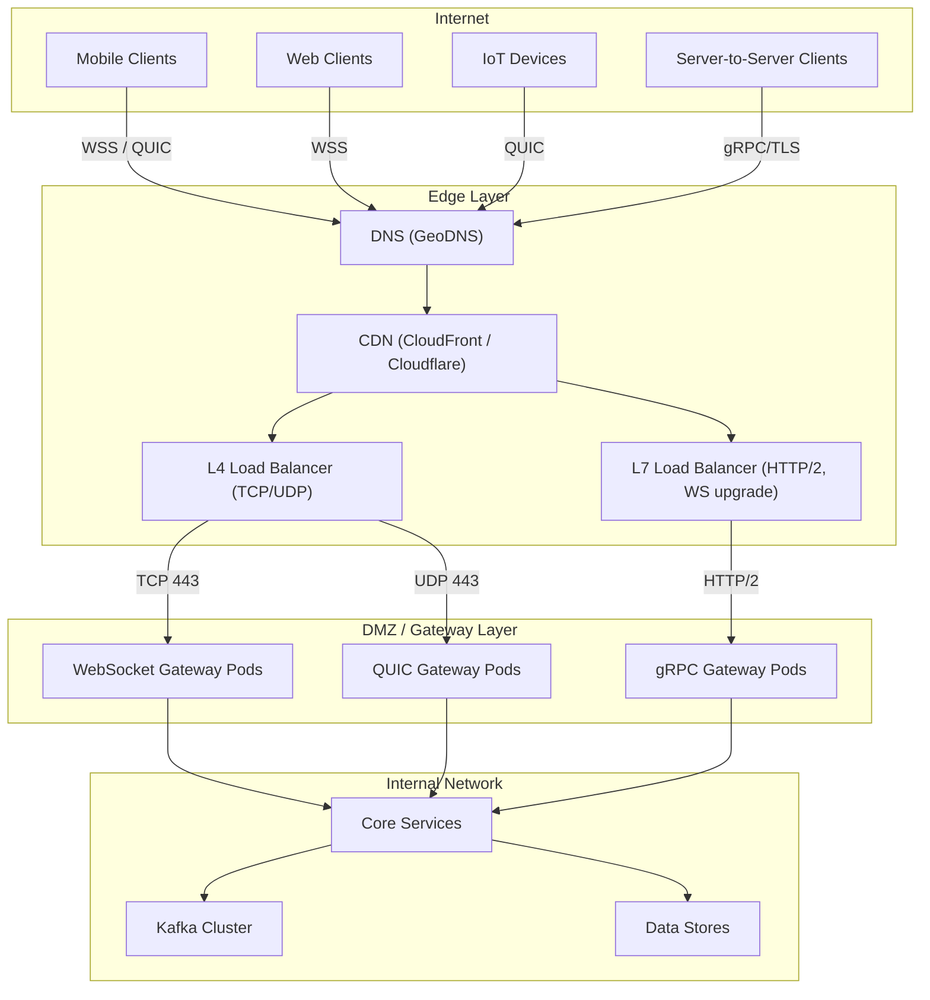
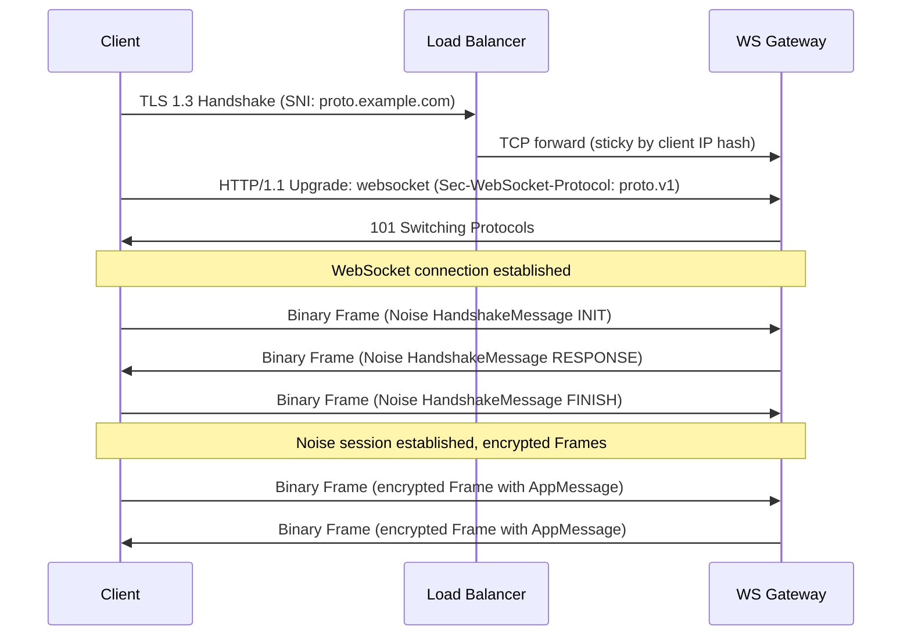
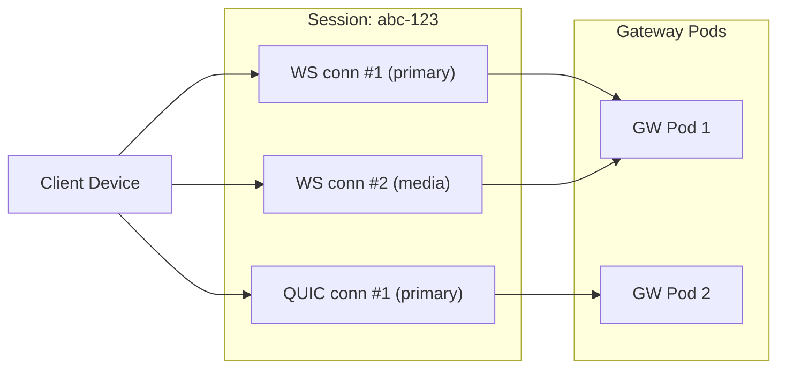
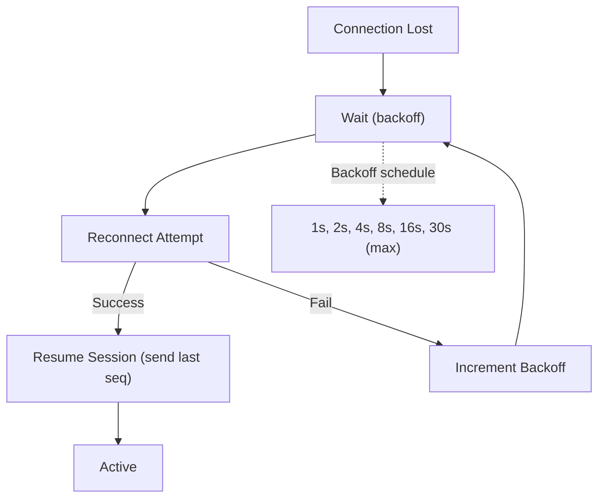
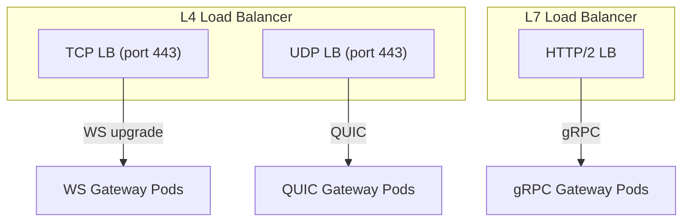
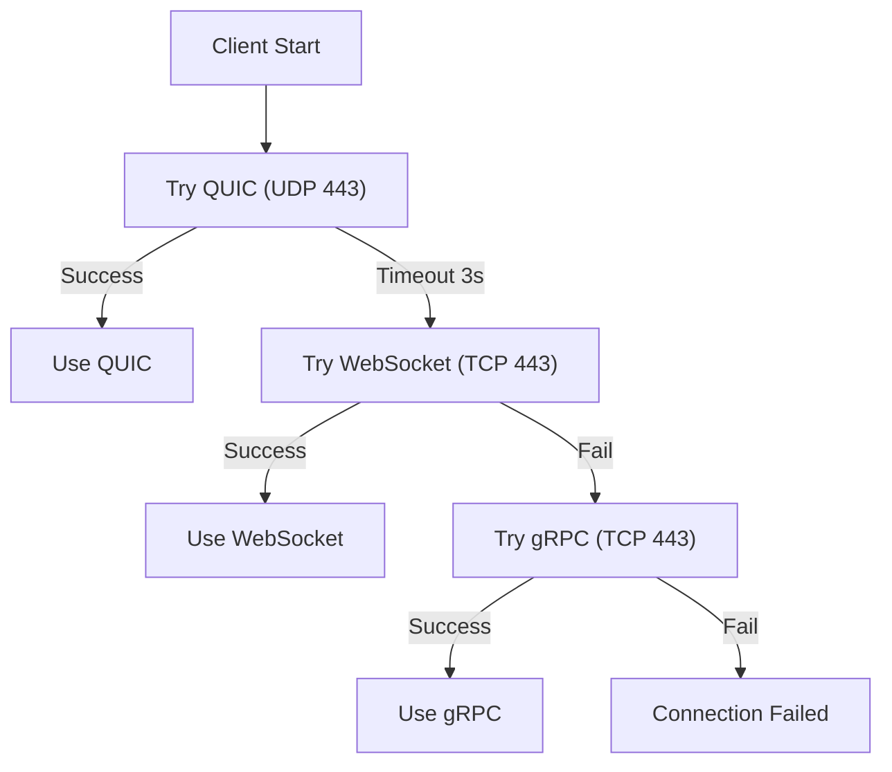

# Proto Protocol -- Network Architecture

**Версия:** 1.0
**Статус:** Draft

**Связанные документы:** [Roadmap](Roadmap.md) | [HLD](HLD.md) | [LLD](LLD.md) | [Data Flows](Data-Flows.md) | [Network Connectivity](Network-Connectivity.md) | [Infrastructure](Infrastructure.md)

---

## 1. Обзор сетевой архитектуры

### 1.1 Сетевая топология



---

## 2. Транспортные протоколы

### 2.1 WebSocket (WSS)

**Порт:** 443 (TLS)
**Применение:** Браузеры, мобильные приложения, универсальный fallback.

| Параметр | Значение |
|----------|---------|
| Протокол | RFC 6455 over TLS 1.3 |
| Subprotocol | `proto.v1` |
| Max frame size | 64 KB |
| Ping interval | 30s |
| Pong timeout | 10s |
| Close handshake timeout | 5s |
| Compression | Per-message deflate (optional) |

**Lifecycle:**



### 2.2 QUIC

**Порт:** 443 (UDP)
**Применение:** Мобильные клиенты (устойчивость к смене сети), IoT-устройства, high-throughput.

| Параметр | Значение |
|----------|---------|
| Протокол | RFC 9000 (QUIC v1) |
| ALPN | `proto/1` |
| Max stream data | 64 KB per stream |
| Max streams (bidi) | 100 |
| Idle timeout | 120s |
| 0-RTT | Поддерживается (для resumption) |
| Connection migration | Поддерживается |

**Преимущества QUIC для Proto:**

- **0-RTT resumption:** При повторном подключении handshake + первое сообщение отправляются в одном RTT
- **Connection migration:** При смене Wi-Fi -> Cellular сессия сохраняется (по connection ID, не по IP:port)
- **Мультиплексирование:** Отдельные потоки для команд и медиа без head-of-line blocking
- **Built-in encryption:** TLS 1.3 интегрирован в QUIC; Noise работает поверх

**Stream allocation:**

| Stream ID | Назначение |
|-----------|-----------|
| Stream 0 | Control channel (Noise handshake, session management) |
| Stream 1 | Primary message channel (AppMessage: chat, ack, ping) |
| Stream 2+ | Media channels (MediaChunk upload/download) |

### 2.3 gRPC (Bidirectional Streaming)

**Порт:** 443 (HTTP/2 over TLS)
**Применение:** Server-to-server коммуникация, microservice integration, CLI-инструменты.

```protobuf
service ProtoTransport {
  rpc Connect(stream Frame) returns (stream Frame);
  rpc Handshake(stream HandshakeMessage) returns (stream HandshakeMessage);
  rpc UploadMedia(stream MediaChunk) returns (MediaUploadResponse);
}
```

| Параметр | Значение |
|----------|---------|
| Протокол | gRPC over HTTP/2, TLS 1.3 |
| Max message size | 64 KB (default), 4 MB (media) |
| Keepalive interval | 30s |
| Keepalive timeout | 10s |
| Max concurrent streams | 100 |
| Compression | gzip (optional) |

**Metadata (gRPC headers):**

| Header | Значение |
|--------|---------|
| `x-proto-session-id` | UUID сессии |
| `x-proto-device-id` | UUID устройства |
| `x-proto-transport` | `grpc` |
| `x-trace-id` | OpenTelemetry trace ID |

---

## 3. Фрейминг

### 3.1 Общий формат

Все транспорты передают одинаковые Protobuf-сообщения `Frame`. Транспорт отвечает только за доставку байтов; формат данных одинаков.

```
Transport Frame (WebSocket Binary / QUIC Stream / gRPC message)
+----------------------------------------------------------+
|  Frame (Protobuf serialized)                              |
|  +------------------------------------------------------+ |
|  | session_id: 16 bytes (UUID)                          | |
|  | seq: uint64 (monotonic counter)                      | |
|  | ack: uint64 (last received seq)                      | |
|  | encrypted_payload: variable length                   | |
|  |   +------------------------------------------------+ | |
|  |   | ChaCha20-Poly1305 encrypted AppMessage          | | |
|  |   | + 16 byte Poly1305 auth tag                     | | |
|  |   +------------------------------------------------+ | |
|  +------------------------------------------------------+ |
+----------------------------------------------------------+
```

### 3.2 Размеры

| Компонент | Размер |
|-----------|--------|
| Frame overhead (Protobuf) | ~30 bytes (session_id + seq + ack + field tags) |
| Crypto overhead | 16 bytes (Poly1305 tag) |
| Min frame (Ping) | ~60 bytes |
| Typical text message | 200--500 bytes |
| Max frame | 64 KB |
| MediaChunk payload | Up to 64 KB |

---

## 4. Управление соединениями

### 4.1 Пул соединений на сессию

Одна сессия может иметь до 5 одновременных транспортных соединений (разных типов):



**Выбор соединения для push (server -> client):**
1. Предпочитать соединение с самым свежим `last_packet_seq`
2. При равных -- предпочитать QUIC > WebSocket > gRPC
3. При недоступности -- fallback на другое соединение из пула

### 4.2 Reconnect-стратегия клиента



**Параметры reconnect:**

| Параметр | Значение |
|----------|---------|
| Initial delay | 1s |
| Max delay | 30s |
| Backoff multiplier | 2x |
| Jitter | +/- 20% |
| Max attempts | unlimited (пока сессия не expired) |
| Transport fallback | QUIC -> WS -> gRPC (configurable order) |

### 4.3 Connection Migration (QUIC)

При смене сети (Wi-Fi -> Cellular):
1. QUIC connection ID сохраняется
2. Новые пакеты отправляются с нового IP:port
3. Path validation (QUIC PATH_CHALLENGE / PATH_RESPONSE)
4. Сессия Proto не прерывается -- Noise state сохраняется

---

## 5. Load Balancing

### 5.1 Архитектура балансировки



### 5.2 Стратегии балансировки

| Транспорт | Уровень | Стратегия | Sticky |
|-----------|---------|----------|--------|
| WebSocket | L4 (TCP) | Consistent hash (client IP) | Да, по TCP-соединению |
| QUIC | L4 (UDP) | QUIC Connection ID routing | Да, по connection ID |
| gRPC | L7 (HTTP/2) | Round-robin / least-connections | Нет (stateless requests) |

### 5.3 Session Affinity

Session affinity обеспечивается на уровне Redis, а не load balancer:
- Любой Gateway pod может обслужить любую сессию
- State хранится в Redis (shared access)
- Push-маршрутизация: SyncService знает, какой Gateway pod удерживает соединение (из `session:{id}:connections`)

### 5.4 Graceful Drain

При обновлении/перезапуске Gateway pod:
1. Pod получает SIGTERM
2. Прекращает принимать новые соединения
3. Отправляет GoAway (gRPC) / Close (WS) всем активным соединениям
4. Ждёт drain timeout (30s) для завершения in-flight requests
5. Завершает процесс

---

## 6. TLS и шифрование

### 6.1 Двухуровневое шифрование

```
Layer 1: Transport Encryption (TLS 1.3 / QUIC crypto)
  - Защищает от перехвата на сетевом уровне
  - Терминируется на Load Balancer или Gateway
  - Стандартные сертификаты (Let's Encrypt / корпоративный CA)

Layer 2: Protocol Encryption (Noise Framework)
  - End-to-end шифрование между клиентом и протокольным слоем
  - Не зависит от транспортного TLS
  - Обеспечивает mutual authentication
  - Ключи управляются протоколом (не PKI)
```

### 6.2 TLS Configuration

| Параметр | Значение |
|----------|---------|
| Версия | TLS 1.3 only |
| Cipher suites | TLS_AES_256_GCM_SHA384, TLS_CHACHA20_POLY1305_SHA256 |
| Key exchange | X25519 |
| Certificate | ECDSA P-256 (или Ed25519) |
| OCSP | Stapling enabled |
| HSTS | max-age=31536000; includeSubDomains |
| Certificate rotation | Automated (cert-manager / Let's Encrypt) |

### 6.3 mTLS (Server-to-Server)

Для gRPC server-to-server коммуникации:
- Каждый сервис имеет клиентский сертификат (выданный внутренним CA)
- Gateway <-> Core Services: mTLS обязателен
- Core Services <-> Kafka: mTLS (SASL/SCRAM как альтернатива)
- Управление: cert-manager + Vault PKI или Istio mTLS

---

## 7. NAT Traversal и Firewall

### 7.1 Совместимость с NAT/Firewall

| Транспорт | NAT/Firewall | Примечания |
|-----------|-------------|-----------|
| WebSocket | Отлично | HTTP Upgrade через 443/TCP; проходит через большинство proxy/firewall |
| QUIC | Хорошо | UDP 443; некоторые корпоративные firewall блокируют UDP |
| gRPC | Отлично | HTTP/2 через 443/TCP; полностью совместим с proxy |

### 7.2 Fallback-стратегия



**Порядок предпочтения (мобильный клиент):**
1. QUIC -- лучшая производительность, connection migration
2. WebSocket -- широкая совместимость
3. gRPC -- fallback

**Порядок предпочтения (браузер):**
1. WebSocket -- нативная поддержка
2. gRPC-Web -- через proxy (ограниченные возможности)

### 7.3 Firewall Rules (серверная сторона)

**Ingress (от клиентов):**

| Source | Destination | Port | Protocol | Назначение |
|--------|-----------|------|---------|-----------|
| 0.0.0.0/0 | LB | TCP 443 | TLS (WS, gRPC) | Client connections |
| 0.0.0.0/0 | LB | UDP 443 | QUIC | Client connections |

**Internal (между компонентами):**

| Source | Destination | Port | Protocol | Назначение |
|--------|-----------|------|---------|-----------|
| Gateway | Redis | TCP 6379 | Redis protocol | Session state |
| Gateway | Core Services | TCP 8443 | gRPC/mTLS | Internal API |
| Core Services | Kafka | TCP 9093 | Kafka/mTLS | Message publishing |
| Core Services | PostgreSQL | TCP 5432 | PostgreSQL/TLS | Data persistence |
| Core Services | S3 | TCP 443 | HTTPS | Media storage |

---

## 8. DNS и Service Discovery

### 8.1 Внешний DNS

- **GeoDNS** для маршрутизации клиентов к ближайшему PoP (Point of Presence)
- A/AAAA записи: `proto.example.com` -> LB IP
- SRV записи (optional): `_proto._tcp.example.com` для service discovery клиентами

### 8.2 Внутренний Service Discovery

| Подход | Технология | Применение |
|--------|-----------|-----------|
| Kubernetes DNS | CoreDNS | Все внутренние сервисы: `service.namespace.svc.cluster.local` |
| Headless Services | K8s headless svc | Kafka brokers, Redis nodes (прямой доступ к pods) |
| Service Mesh | Istio / Linkerd (optional) | mTLS, traffic management, observability |

### 8.3 Адреса внутренних сервисов

| Сервис | DNS-имя | Port |
|--------|---------|------|
| WS Gateway | `ws-gateway.proto.svc.cluster.local` | 8080 |
| QUIC Gateway | `quic-gateway.proto.svc.cluster.local` | 8443 |
| gRPC Gateway | `grpc-gateway.proto.svc.cluster.local` | 8443 |
| Session Manager | `session-manager.proto.svc.cluster.local` | 8443 |
| Dispatcher | `dispatcher.proto.svc.cluster.local` | 8443 |
| Kafka (bootstrap) | `kafka.kafka.svc.cluster.local` | 9093 |
| Redis | `redis.redis.svc.cluster.local` | 6379 |
| PostgreSQL | `postgres-primary.postgres.svc.cluster.local` | 5432 |
| S3 (MinIO) | `minio.minio.svc.cluster.local` | 9000 |
