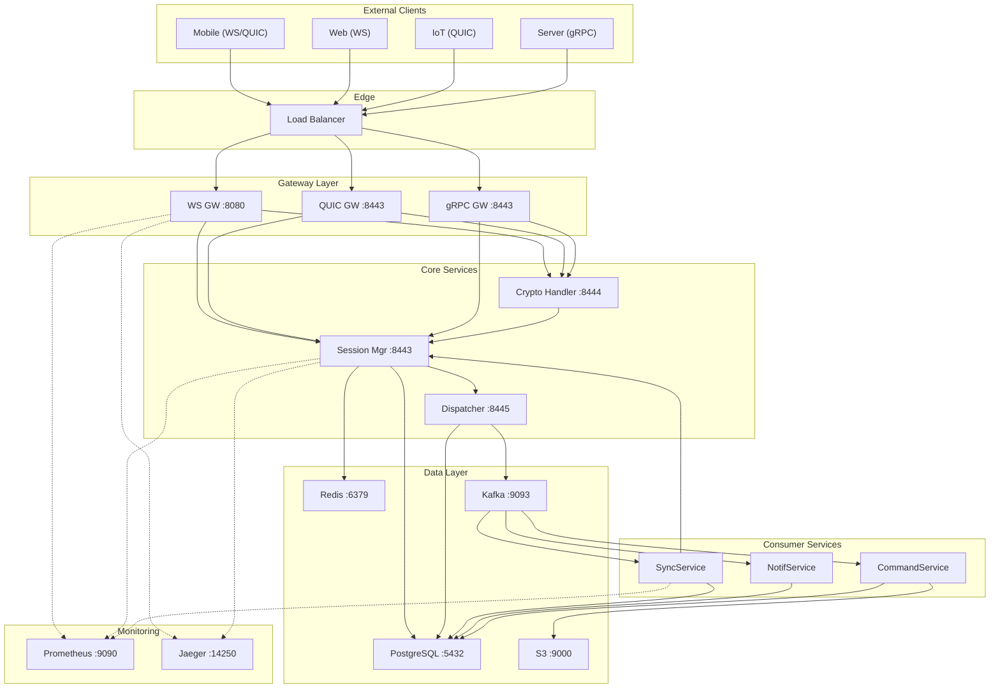

# Proto Protocol -- Network Connectivity

**Версия:** 1.0
**Статус:** Draft

**Связанные документы:** [Roadmap](Roadmap.md) | [HLD](HLD.md) | [LLD](LLD.md) | [Network Architecture](Network-Architecture.md) | [Data Flows](Data-Flows.md) | [Infrastructure](Infrastructure.md)

---

## 1. Обзор сетевой связанности

### 1.1 Компоненты системы

| ID | Компонент | Тип | Replicas (prod) |
|----|----------|-----|----------------|
| C1 | Mobile Client | External | N/A |
| C2 | Web Client | External | N/A |
| C3 | IoT Device | External | N/A |
| C4 | Service Client | External | N/A |
| LB | Load Balancer | Infrastructure | 2 (active-passive) |
| GW-WS | WebSocket Gateway | Service | 4--16 (HPA) |
| GW-QUIC | QUIC Gateway | Service | 4--16 (HPA) |
| GW-GRPC | gRPC Gateway | Service | 4--8 (HPA) |
| SM | Session Manager | Service | 3--6 |
| CH | Crypto Handler | Service | 3--6 (co-located with SM) |
| DISP | Dispatcher | Service | 3--6 |
| SS | SyncService | Service | 32--128 (consumer group) |
| NS | NotificationService | Service | 16--64 |
| CS | CommandService | Service | 8--32 |
| KF | Kafka Cluster | Data | 3--5 brokers |
| RD | Redis Cluster | Data | 6 nodes (3 primary + 3 replica) |
| PG | PostgreSQL | Data | 1 primary + 2 replicas (per shard) |
| S3 | Object Storage | Data | Managed (MinIO / AWS S3) |
| PROM | Prometheus | Monitoring | 2 (HA pair) |
| GRAF | Grafana | Monitoring | 2 |
| JAEG | Jaeger | Monitoring | 1 collector + 1 query |

---

## 2. Матрица связанности

### 2.1 Полная матрица (Source -> Destination)

| Source | Destination | Protocol | Port | TLS/Auth | Direction | Описание |
|--------|-----------|----------|------|---------|-----------|---------|
| C1, C2 | LB | TCP (WSS) | 443 | TLS 1.3 | Ingress | WebSocket-клиенты |
| C1, C3 | LB | UDP (QUIC) | 443 | QUIC crypto | Ingress | QUIC-клиенты |
| C4 | LB | TCP (gRPC) | 443 | TLS 1.3 | Ingress | gRPC server-to-server |
| LB | GW-WS | TCP | 8080 | Plaintext (internal) | Internal | WS proxy pass |
| LB | GW-QUIC | UDP | 8443 | Plaintext (internal) | Internal | QUIC proxy pass |
| LB | GW-GRPC | TCP | 8443 | Plaintext (internal) | Internal | gRPC proxy pass |
| GW-* | SM | gRPC | 8443 | mTLS | Internal | Session CRUD, routing |
| GW-* | CH | gRPC | 8444 | mTLS | Internal | Encrypt/decrypt |
| SM | RD | Redis | 6379 | AUTH + TLS | Internal | Session state R/W |
| SM | PG | PostgreSQL | 5432 | TLS + password | Internal | Session backup |
| CH | SM | gRPC | 8443 | mTLS | Internal | Auth validation |
| DISP | PG | PostgreSQL | 5432 | TLS + password | Internal | Outbox write |
| DISP | KF | Kafka | 9093 | mTLS (SASL) | Internal | Produce messages |
| SS | KF | Kafka | 9093 | mTLS (SASL) | Internal | Consume messages |
| SS | PG | PostgreSQL | 5432 | TLS + password | Internal | Inbox write |
| SS | SM | gRPC | 8443 | mTLS | Internal | Push to user |
| NS | KF | Kafka | 9093 | mTLS (SASL) | Internal | Consume notifications |
| NS | External | HTTPS | 443 | TLS + API key | Egress | APNs, FCM push |
| CS | KF | Kafka | 9093 | mTLS (SASL) | Internal | Consume commands |
| CS | PG | PostgreSQL | 5432 | TLS + password | Internal | Group/user metadata |
| CS | S3 | HTTPS | 9000/443 | Access key | Internal | Media operations |
| All services | PROM | HTTP | 9090 | Plaintext (internal) | Internal | Metrics scrape |
| All services | JAEG | gRPC | 14250 | Plaintext (internal) | Internal | Trace export |

### 2.2 Визуализация связей



---

## 3. Детали подключений по компонентам

### 3.1 Load Balancer -> Gateway

| Параметр | WebSocket | QUIC | gRPC |
|----------|----------|------|------|
| LB type | L4 (TCP passthrough) | L4 (UDP passthrough) | L7 (HTTP/2 aware) |
| Backend protocol | TCP | UDP | HTTP/2 |
| Health check | TCP connect :8080 | HTTP GET :8081/healthz | gRPC health check |
| Session affinity | Source IP hash | Connection ID | None (stateless) |
| Drain timeout | 30s | 30s | 15s |
| Max connections per backend | 50,000 | 50,000 | 10,000 |

### 3.2 Gateway -> Session Manager

```
Protocol:   gRPC (HTTP/2)
Port:       8443
Auth:       mTLS (service certificate)
Timeout:    5s (per RPC)
Retry:      3 attempts, exponential backoff (100ms, 200ms, 400ms)
Circuit breaker: Open after 5 consecutive failures, half-open after 10s
Load balancing: Client-side round-robin (via Kubernetes headless service)
```

### 3.3 Session Manager -> Redis

```
Protocol:   Redis RESP3
Port:       6379
Auth:       AUTH (password from K8s secret) + TLS
Connection pool:
  - Min idle: 10
  - Max active: 100
  - Max idle time: 5min
  - Connect timeout: 2s
  - Read timeout: 1s
  - Write timeout: 1s
Retry:      3 attempts with 100ms backoff
Pipeline:   Enabled (batch reads)
Cluster mode: Redis Cluster (6 nodes, 3 primary + 3 replica)
```

### 3.4 Dispatcher -> Kafka

```
Protocol:   Kafka wire protocol
Port:       9093 (TLS)
Auth:       mTLS + SASL/SCRAM-SHA-256
Producer config:
  - acks: all
  - retries: MAX_INT
  - max.in.flight.requests: 5
  - enable.idempotence: true
  - linger.ms: 5
  - batch.size: 64KB
  - compression: lz4
  - delivery.timeout.ms: 120s
Connection:
  - Bootstrap servers: kafka-0:9093,kafka-1:9093,kafka-2:9093
  - Metadata refresh: 300s
```

### 3.5 SyncService -> Kafka

```
Protocol:   Kafka wire protocol
Port:       9093 (TLS)
Auth:       mTLS + SASL/SCRAM-SHA-256
Consumer config:
  - group.id: sync-service
  - auto.offset.reset: earliest
  - enable.auto.commit: false
  - max.poll.records: 500
  - session.timeout.ms: 30s
  - heartbeat.interval.ms: 10s
  - isolation.level: read_committed
Subscriptions:
  - user-messages (128 partitions)
  - group-messages (64 partitions)
```

### 3.6 Services -> PostgreSQL

```
Protocol:   PostgreSQL wire protocol
Port:       5432
Auth:       TLS + username/password (from K8s secret)
Connection pool (per service instance):
  - Min connections: 5
  - Max connections: 50
  - Max idle time: 10min
  - Connect timeout: 5s
  - Query timeout: 30s
  - Statement cache: enabled (LRU, 256 entries)
Read routing:
  - Writes: primary only
  - Reads: replica (with acceptable staleness)
  - Strong reads: primary
```

### 3.7 Services -> S3 / MinIO

```
Protocol:   S3 API (HTTPS)
Port:       9000 (MinIO) / 443 (AWS S3)
Auth:       AWS Signature V4 (access key + secret key from K8s secret)
Connection pool:
  - Max idle connections: 100
  - Idle timeout: 90s
Configuration:
  - Region: us-east-1 (or custom for MinIO)
  - Bucket: proto-media
  - Path style: true (MinIO) / false (AWS S3)
  - Presigned URL expiry: 1h (download), 15min (upload)
  - Multipart threshold: 5MB
  - Part size: 5MB
```

---

## 4. Сетевые политики (Network Policies)

### 4.1 Kubernetes NetworkPolicy

```yaml
# Gateway pods: allow ingress from LB, egress to core services
apiVersion: networking.k8s.io/v1
kind: NetworkPolicy
metadata:
  name: gateway-policy
  namespace: proto
spec:
  podSelector:
    matchLabels:
      app.kubernetes.io/component: gateway
  policyTypes:
    - Ingress
    - Egress
  ingress:
    - from:
        - namespaceSelector:
            matchLabels:
              name: ingress
      ports:
        - port: 8080    # WS
        - port: 8443    # QUIC / gRPC
  egress:
    - to:
        - podSelector:
            matchLabels:
              app.kubernetes.io/component: session-manager
      ports:
        - port: 8443
    - to:
        - podSelector:
            matchLabels:
              app.kubernetes.io/component: crypto-handler
      ports:
        - port: 8444
    - to:
        - namespaceSelector:
            matchLabels:
              name: monitoring
      ports:
        - port: 9090   # Prometheus
        - port: 14250  # Jaeger
```

### 4.2 Матрица сетевых политик

| Source Namespace | Source Label | Dest Namespace | Dest Label | Ports | Allow |
|-----------------|-------------|---------------|-----------|-------|-------|
| ingress | ingress-controller | proto | gateway | 8080, 8443 | Yes |
| proto | gateway | proto | session-manager | 8443 | Yes |
| proto | gateway | proto | crypto-handler | 8444 | Yes |
| proto | session-manager | redis | redis | 6379 | Yes |
| proto | session-manager | postgres | postgres | 5432 | Yes |
| proto | dispatcher | postgres | postgres | 5432 | Yes |
| proto | dispatcher | kafka | kafka | 9093 | Yes |
| proto | sync-service | kafka | kafka | 9093 | Yes |
| proto | sync-service | postgres | postgres | 5432 | Yes |
| proto | sync-service | proto | session-manager | 8443 | Yes |
| proto | notification-service | kafka | kafka | 9093 | Yes |
| proto | command-service | kafka | kafka | 9093 | Yes |
| proto | command-service | postgres | postgres | 5432 | Yes |
| proto | command-service | minio | minio | 9000 | Yes |
| proto | * | monitoring | prometheus | 9090 | Yes |
| proto | * | monitoring | jaeger | 14250 | Yes |
| * | * | * | * | * | **Deny** (default) |

---

## 5. Service Discovery

### 5.1 Kubernetes-based Discovery

Все внутренние сервисы обнаруживаются через Kubernetes DNS:

```
<service>.<namespace>.svc.cluster.local
```

| Сервис | DNS-имя | Service Type | Endpoints |
|--------|---------|-------------|-----------|
| WS Gateway | ws-gateway.proto.svc.cluster.local | ClusterIP | Pod IPs (HPA) |
| QUIC Gateway | quic-gateway.proto.svc.cluster.local | ClusterIP | Pod IPs (HPA) |
| gRPC Gateway | grpc-gateway.proto.svc.cluster.local | ClusterIP | Pod IPs (HPA) |
| Session Manager | session-manager.proto.svc.cluster.local | Headless | Pod IPs (для client-side LB) |
| Crypto Handler | crypto-handler.proto.svc.cluster.local | Headless | Pod IPs |
| Dispatcher | dispatcher.proto.svc.cluster.local | ClusterIP | Pod IPs |
| Kafka | kafka-headless.kafka.svc.cluster.local | Headless | Broker IPs |
| Redis | redis.redis.svc.cluster.local | ClusterIP | Redis Cluster IPs |
| PostgreSQL (primary) | postgres-primary.postgres.svc.cluster.local | ClusterIP | Primary IP |
| PostgreSQL (replica) | postgres-replica.postgres.svc.cluster.local | ClusterIP | Replica IPs |
| MinIO | minio.minio.svc.cluster.local | ClusterIP | MinIO IP |

### 5.2 External DNS (Client-facing)

```
proto.example.com          A     -> LB external IP (GeoDNS)
proto.example.com          AAAA  -> LB external IPv6
_proto._tcp.example.com    SRV   -> 0 0 443 proto.example.com (optional)
```

### 5.3 Service Mesh (Optional -- Istio)

При использовании Istio:
- **mTLS:** автоматический между всеми pods в mesh
- **Traffic management:** canary deployments, circuit breakers
- **Observability:** автоматические метрики L7, distributed tracing
- **Retries:** настраиваемые retry-политики на уровне mesh

```
VirtualService: session-manager
  - route:
    - destination: session-manager.proto.svc.cluster.local
      weight: 100
    retries:
      attempts: 3
      perTryTimeout: 2s
    timeout: 10s
```

---

## 6. Latency Budget

### 6.1 End-to-End Latency (Sender -> Recipient, online)

| Hop | Estimated Latency | Cumulative |
|-----|------------------|-----------|
| Client -> LB (internet) | 10--50ms | 10--50ms |
| LB -> Gateway | < 1ms | 11--51ms |
| Gateway -> Crypto Handler (decrypt) | 1--2ms | 12--53ms |
| Crypto Handler -> Dispatcher | < 1ms | 13--54ms |
| Dispatcher -> Outbox (PG write) | 2--5ms | 15--59ms |
| Outbox -> Kafka (produce) | 2--5ms | 17--64ms |
| Kafka -> SyncService (consume) | 1--5ms | 18--69ms |
| SyncService -> Inbox (PG write) | 2--5ms | 20--74ms |
| SyncService -> Session Manager (push) | 1--2ms | 21--76ms |
| Session Manager -> Gateway (route) | < 1ms | 22--77ms |
| Gateway -> Crypto Handler (encrypt) | 1--2ms | 23--79ms |
| Gateway -> LB -> Recipient (internet) | 10--50ms | 33--129ms |

**Target p99:** < 100ms (within same region, excluding internet latency)

### 6.2 Bottleneck Analysis

| Компонент | Потенциальное узкое место | Mitigation |
|-----------|-------------------------|-----------|
| PostgreSQL (Outbox write) | Disk I/O при высоком throughput | SSD, batched writes, async relay |
| Kafka (produce) | Replication latency (acks=all) | Tune min.insync.replicas, SSD |
| Redis (session lookup) | Memory pressure | Cluster sharding, eviction policy |
| Crypto Handler | CPU-bound (ChaCha20) | Horizontal scaling, SIMD optimizations |
| Internet latency | Geography | GeoDNS, multi-region deployment |
