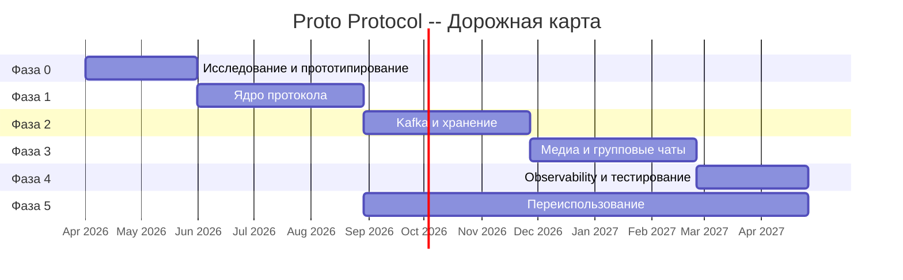

# Proto Protocol -- Roadmap

Детальный план реализации протокола Proto с чек-листом задач, оценками сроков, зависимостями и критериями приёмки.

**Связанные документы:** [HLD](HLD.md) | [LLD](LLD.md) | [Network Architecture](Network-Architecture.md) | [Data Flows](Data-Flows.md) | [Network Connectivity](Network-Connectivity.md) | [Infrastructure](Infrastructure.md)

---

## Обзор фаз

---

## Фаза 0 -- Исследование и прототипирование

**Длительность:** 1--2 месяца
**Цель:** Валидация ключевых технологических решений, настройка инфраструктуры разработки.
**Зависимости:** нет (стартовая фаза).

### 0.1 Инфраструктура разработки

- [x] **T-0.1.1** Выбор языка серверной части (Go vs Rust) -- провести сравнительный анализ по критериям: экосистема Noise/Kafka/QUIC, производительность, скорость разработки
- [x] **T-0.1.2** Выбор языков клиентских SDK (Swift / Kotlin / TypeScript) -- зафиксировать в ADR
- [x] **T-0.1.3** Инициализация монорепозитория -- структура каталогов: `proto/`, `server/`, `sdk/`, `docs/`, `deploy/`
- [x] **T-0.1.4** Настройка CI pipeline (GitHub Actions / GitLab CI) -- линтинг, сборка, юнит-тесты
- [x] **T-0.1.5** Настройка линтеров и форматтеров (golangci-lint / clippy, protolint)
- [x] **T-0.1.6** Создание dev-окружения (Docker Compose): Redis, PostgreSQL, Kafka (single-node), MinIO

### 0.2 Protobuf-схемы

- [x] **T-0.2.1** Определить `Frame` (session_id, seq, ack, encrypted_payload)
- [x] **T-0.2.2** Определить `AppMessage` (message_id, timestamp, oneof body)
- [x] **T-0.2.3** Определить типы `ChatMessage`, `Command`, `MediaChunk`, `Ack`, `Ping`
- [x] **T-0.2.4** Настроить генерацию кода из .proto (Go, Swift, Kotlin, TypeScript)
- [x] **T-0.2.5** Написать валидационные тесты для сериализации/десериализации

### 0.3 Proof of Concept

- [x] **T-0.3.1** Реализовать Noise_XX handshake (XX pattern, X25519, ChaChaPoly, BLAKE2s) -- библиотека `flynn/noise` (Go) или `snow` (Rust)
- [x] **T-0.3.2** Реализовать WebSocket-транспорт (клиент + сервер)
- [x] **T-0.3.3** Интегрировать Noise handshake с WebSocket -- шифрование/дешифрование Frame
- [x] **T-0.3.4** Эхо-сервер: приём зашифрованного Frame, расшифровка, отправка обратно
- [x] **T-0.3.5** Бенчмарк: throughput (msg/sec), latency (p50/p99), CPU/RAM при 1K/10K concurrent connections
- [x] **T-0.3.6** Документирование результатов PoC, принятие/отклонение технологических решений

**Критерии приёмки Фазы 0:**
- Noise handshake работает поверх WebSocket, пакеты шифруются/дешифруются корректно
- Protobuf-схемы компилируются для всех целевых языков
- CI pipeline проходит без ошибок
- Бенчмарк показывает >= 50K msg/sec на одном ядре

---

## Фаза 1 -- Ядро протокола

**Длительность:** 2--3 месяца
**Цель:** Полноценный протокольный стек с тремя транспортами, сессиями и криптографией.
**Зависимости:** Фаза 0 завершена.

### 1.1 Session Manager

- [x] **T-1.1.1** Спроектировать state machine сессии: `connecting` -> `active` -> `sleeping` -> `expired`
- [x] **T-1.1.2** Реализовать хранение сессий в Redis: ключ `session:<session_id>`, поля: user_id, device_id, crypto_state, connections, created_at, expires_at
- [x] **T-1.1.3** Реализовать дублирование состояния сессии в PostgreSQL (для recovery)
- [x] **T-1.1.4** Реализовать привязку сессии к устройству (device_id), поддержка нескольких соединений на сессию
- [x] **T-1.1.5** Реализовать таймауты: переход в `sleeping` (configurable, default 5 min), переход в `expired` (configurable, default 24h)
- [x] **T-1.1.6** Реализовать аутентификацию при создании сессии (токен-based)
- [x] **T-1.1.7** Unit-тесты Session Manager (все переходы состояний, edge cases)

### 1.2 Криптографический слой

- [x] **T-1.2.1** Полная реализация Noise_XX_25519_ChaChaPoly_BLAKE2s -- серверная сторона
- [x] **T-1.2.2** Шифрование payload: ChaCha20-Poly1305 с 96-bit nonce (на основе seq counter)
- [x] **T-1.2.3** Реализовать ротацию ключей без разрыва сессии (Noise rekey)
- [x] **T-1.2.4** Защищённое хранение ключей в памяти (zeroize при уничтожении)
- [x] **T-1.2.5** Криптографически стойкий генератор для эфемерных ключей
- [x] **T-1.2.6** Тесты: корректность handshake, ротация, replay-атаки, подмена nonce

### 1.3 Транспорты

- [x] **T-1.3.1** Абстракция транспорта: интерфейс `Transport` (Connect, Send, Receive, Close)
- [x] **T-1.3.2** Реализация QUIC-транспорта (библиотека `quic-go` / `quinn`)
- [x] **T-1.3.3** Реализация gRPC streaming транспорта (bidirectional stream)
- [x] **T-1.3.4** Управление пулом соединений на сервере (выбор активного соединения для push)
- [x] **T-1.3.5** Reconnect-логика: автоматическое переподключение при потере соединения, сессия сохраняется
- [x] **T-1.3.6** Интеграционные тесты: все три транспорта (WS, QUIC, gRPC) с полным Noise handshake

### 1.4 Клиентские SDK

- [x] **T-1.4.1** Go SDK (reference implementation) с абстракцией транспорта
- [x] **T-1.4.2** TypeScript/JS SDK (WebSocket-транспорт, noise-c.wasm)
- [x] **T-1.4.3** Kotlin SDK (OkHttp WebSocket, noise-java)
- [x] **T-1.4.4** Swift SDK (Starscream WebSocket, CryptoKit)
- [x] **T-1.4.5** SDK: автоматический выбор транспорта, reconnect, экспоненциальный backoff
- [x] **T-1.4.6** Интеграционные end-to-end тесты SDK <-> сервер

**Критерии приёмки Фазы 1:**
- Клиент может подключиться по любому из трёх транспортов, пройти Noise handshake, обмениваться зашифрованными Frame
- Сессия сохраняется при переключении соединений
- Ротация ключей проходит без потери пакетов
- SDK для всех платформ проходят e2e тесты

---

## Фаза 2 -- Kafka и хранение

**Длительность:** 2--3 месяца
**Цель:** Интеграция с Kafka, реализация Dispatcher, Outbox/Inbox, офлайн-синхронизация.
**Зависимости:** Фаза 1 (Session Manager, криптослой).

### 2.1 Dispatcher

- [ ] **T-2.1.1** Реализовать Dispatcher: приём расшифрованных AppMessage, определение топика Kafka
- [ ] **T-2.1.2** Маршрутизация: `user-<recipient_id>` для личных, `group-<group_id>` для групповых, `commands` для команд
- [ ] **T-2.1.3** Партиционирование по ключу (recipient_id / group_id) для гарантии порядка
- [ ] **T-2.1.4** Kafka producer: `acks=all`, `min.insync.replicas=2`, идемпотентный producer
- [ ] **T-2.1.5** Unit-тесты маршрутизации, интеграционные тесты с Kafka

### 2.2 Outbox-паттерн

- [ ] **T-2.2.1** Спроектировать таблицу `outbox` (PostgreSQL): id, message_id, topic, key, payload, status, created_at
- [ ] **T-2.2.2** Реализовать транзакционную запись: сохранение в Outbox + отправка Ack клиенту
- [ ] **T-2.2.3** Outbox relay: фоновый процесс, читает из Outbox, публикует в Kafka, обновляет статус
- [ ] **T-2.2.4** Обработка сбоев: retry с экспоненциальным backoff, dead letter queue
- [ ] **T-2.2.5** Тесты: гарантия at-least-once delivery при crash сервера

### 2.3 SyncService (Consumer)

- [ ] **T-2.3.1** Реализовать SyncService -- Kafka consumer group
- [ ] **T-2.3.2** Inbox: сохранение входящих сообщений в PostgreSQL (таблица `inbox`: user_id, message_id, payload, delivered, created_at)
- [ ] **T-2.3.3** Push онлайн-клиентам: доставка через Session Manager -> Transport Gateway
- [ ] **T-2.3.4** Дедупликация по message_id (идемпотентная обработка)
- [ ] **T-2.3.5** Интеграционные тесты consumer pipeline

### 2.4 Офлайн-синхронизация

- [ ] **T-2.4.1** Клиент отправляет `last_seen_message_id` при подключении
- [ ] **T-2.4.2** Session Manager выполняет `seek` на consumer к нужному offset
- [ ] **T-2.4.3** Потоковая доставка пропущенных сообщений (backfill)
- [ ] **T-2.4.4** Пагинация при большом количестве пропущенных сообщений
- [ ] **T-2.4.5** Тесты: сценарии офлайн 1 час, 1 день, 7 дней

### 2.5 Kafka-инфраструктура

- [ ] **T-2.5.1** Настройка топиков: `user-*` (128 партиций), `group-*` (64 партиций), `commands` (32 партиции), `events` (64 партиции)
- [ ] **T-2.5.2** Replication factor = 3, min.insync.replicas = 2
- [ ] **T-2.5.3** Retention policy: `user-*` -- 30 дней, `events` -- 90 дней
- [ ] **T-2.5.4** Мониторинг Kafka: lag monitoring, consumer group health
- [ ] **T-2.5.5** Документация по масштабированию партиций

**Критерии приёмки Фазы 2:**
- Сообщение проходит путь: Client -> Gateway -> Dispatcher -> Kafka -> SyncService -> Recipient
- Outbox гарантирует at-least-once delivery даже при crash
- Офлайн-клиент получает все пропущенные сообщения при reconnect
- Дедупликация работает корректно (нет дублей у получателя)

---

## Фаза 3 -- Медиа и групповые чаты

**Длительность:** 2--3 месяца
**Цель:** Потоковая передача медиа, E2E-шифрование для групп, админ-функции.
**Зависимости:** Фаза 2 (Kafka pipeline, SyncService).

### 3.1 Потоковая передача медиа

- [ ] **T-3.1.1** Выделенный медиа-канал: отдельное соединение или мультиплексированный поток (QUIC stream / gRPC stream)
- [ ] **T-3.1.2** Чанкинг на клиенте: разбиение файла на chunks (64 KB), формирование `MediaChunk` (stream_id, chunk_index, total_chunks, hash)
- [ ] **T-3.1.3** Серверная агрегация: временное хранение chunks (RAM + диск), сборка файла
- [ ] **T-3.1.4** Валидация: проверка hash каждого chunk и итогового файла
- [ ] **T-3.1.5** Загрузка в S3-совместимое хранилище (MinIO / AWS S3)
- [ ] **T-3.1.6** Публикация мета-сообщения в Kafka с URL файла
- [ ] **T-3.1.7** Тесты: загрузка файлов 1 MB, 100 MB, 1 GB; обработка потери chunk; resume upload

### 3.2 Sender Keys (групповое E2E-шифрование)

- [ ] **T-3.2.1** Генерация sender_key для каждого участника группы
- [ ] **T-3.2.2** Распространение sender_key через защищённые 1-to-1 каналы (используя Noise-сессии)
- [ ] **T-3.2.3** Шифрование группового сообщения одним sender_key (однократное шифрование на группу)
- [ ] **T-3.2.4** Регулярная ротация sender_key (при добавлении/удалении участника, по таймеру)
- [ ] **T-3.2.5** Forward secrecy: ratchet sender_key после каждого сообщения
- [ ] **T-3.2.6** Тесты: группа 2, 10, 100 участников; ротация при join/leave; replay protection

### 3.3 Административные команды

- [ ] **T-3.3.1** Создание группы (Command: CreateGroup)
- [ ] **T-3.3.2** Добавление/удаление участников (Command: AddMember, RemoveMember)
- [ ] **T-3.3.3** Смена настроек группы (Command: UpdateGroupSettings)
- [ ] **T-3.3.4** Модерация: удаление сообщений, бан участников
- [ ] **T-3.3.5** Обработка команд через топик `commands` в Kafka
- [ ] **T-3.3.6** Тесты: все команды, edge cases (удаление последнего админа, concurrent updates)

### 3.4 Потоковое видео/аудио (сигнализация)

- [ ] **T-3.4.1** Управляющие сигналы через основной протокол: StartStream, EndStream, JoinStream
- [ ] **T-3.4.2** Интеграция с WebRTC: exchange SDP/ICE через Proto-канал
- [ ] **T-3.4.3** Тесты: установка видеозвонка через Proto-сигнализацию

**Критерии приёмки Фазы 3:**
- Файл загружается по частям, собирается на сервере, сохраняется в S3, получатель получает ссылку
- Групповые сообщения шифруются Sender Keys, все участники расшифровывают
- Ротация ключей при изменении состава группы
- Админ-команды корректно обрабатываются

---

## Фаза 4 -- Observability и тестирование

**Длительность:** 2 месяца
**Цель:** Наблюдаемость, устойчивость к отказам, нагрузочное тестирование.
**Зависимости:** Фаза 3 (полный функционал).

### 4.1 Tracing и метрики

- [ ] **T-4.1.1** Интеграция OpenTelemetry SDK (traces): span на каждый этап обработки сообщения
- [ ] **T-4.1.2** Метрики: messages_sent/received (counter), handshake_duration (histogram), active_sessions (gauge), kafka_lag (gauge)
- [ ] **T-4.1.3** Экспорт в Prometheus + визуализация в Grafana (dashboards)
- [ ] **T-4.1.4** Distributed tracing: Jaeger, trace_id propagation через Kafka headers
- [ ] **T-4.1.5** Структурированные логи (JSON): correlation с trace_id

### 4.2 Нагрузочное тестирование

- [ ] **T-4.2.1** Сценарии k6/JMeter: 10K, 50K, 100K concurrent connections
- [ ] **T-4.2.2** Бенчмарк throughput: сообщений/сек при различных размерах payload (100B, 1KB, 10KB)
- [ ] **T-4.2.3** Бенчмарк latency: p50, p95, p99 end-to-end (отправитель -> получатель)
- [ ] **T-4.2.4** Бенчмарк Kafka: throughput при различном количестве партиций и consumers
- [ ] **T-4.2.5** Профилирование: CPU, memory, GC pauses (pprof / perf)
- [ ] **T-4.2.6** Отчёт о производительности с рекомендациями

### 4.3 Chaos Engineering

- [ ] **T-4.3.1** Тест: crash Kafka-брокера -- сообщения не теряются (Outbox retry)
- [ ] **T-4.3.2** Тест: Redis unavailable -- graceful degradation, session recovery из PostgreSQL
- [ ] **T-4.3.3** Тест: network partition между Gateway и Kafka
- [ ] **T-4.3.4** Тест: высокая latency (tc netem) -- backpressure, корректная работа reconnect
- [ ] **T-4.3.5** Тест: rolling update серверов -- zero-downtime, сессии сохраняются

### 4.4 Документация API

- [ ] **T-4.4.1** gRPC service definitions с комментариями (buf.build)
- [ ] **T-4.4.2** Protobuf documentation generation
- [ ] **T-4.4.3** Руководство по интеграции для разработчиков
- [ ] **T-4.4.4** Примеры использования SDK (quickstart для каждой платформы)

**Критерии приёмки Фазы 4:**
- Dashboards в Grafana показывают ключевые метрики в реальном времени
- Система выдерживает 100K concurrent connections
- p99 latency < 100ms для текстовых сообщений
- Система корректно переживает отказ любого одного компонента

---

## Фаза 5 -- Переиспользование протокола

**Длительность:** параллельно с Фазами 2--4
**Цель:** Выделение ядра протокола в переиспользуемую библиотеку с примерами адаптации.
**Зависимости:** Фаза 1 (ядро протокола).

### 5.1 Выделение ядра

- [ ] **T-5.1.1** Рефакторинг: разделение на `proto-core` (транспорт, сессии, криптография) и `proto-messenger` (бизнес-логика)
- [ ] **T-5.1.2** Определение публичного API `proto-core`: интерфейсы, конфигурация, хуки
- [ ] **T-5.1.3** Публикация `proto-core` как отдельного модуля/пакета
- [ ] **T-5.1.4** Документация API `proto-core`

### 5.2 Примеры адаптации

- [ ] **T-5.2.1** IoT-пример: `Telemetry` + `ControlCommand`, топики `device-<id>`, аутентификация сертификатами
- [ ] **T-5.2.2** Финансовый пример: ордера, подтверждения, Ed25519-подписи, Kafka transactions
- [ ] **T-5.2.3** Игровой пример: `GameAction` + `StateUpdate`, топик `game-<id>`, низкая latency через QUIC
- [ ] **T-5.2.4** Система уведомлений: `Notification`, топик `notify-<user_id>`, упрощённый сессионный слой

### 5.3 Спецификация

- [ ] **T-5.3.1** Формальная спецификация протокола (RFC-style)
- [ ] **T-5.3.2** Публикация Protobuf-схем в открытый реестр
- [ ] **T-5.3.3** Conformance test suite для валидации реализаций

**Критерии приёмки Фазы 5:**
- `proto-core` используется как зависимость в `proto-messenger` и во всех примерах
- Каждый пример запускается и демонстрирует end-to-end flow
- Спецификация достаточна для реализации совместимого клиента/сервера с нуля

---

## Сводная таблица зависимостей

| Фаза | Зависит от | Блокирует |
|------|-----------|-----------|
| Фаза 0 | -- | Фаза 1 |
| Фаза 1 | Фаза 0 | Фазы 2, 5 |
| Фаза 2 | Фаза 1 | Фаза 3 |
| Фаза 3 | Фаза 2 | Фаза 4 |
| Фаза 4 | Фаза 3 | -- |
| Фаза 5 | Фаза 1 | -- (параллельно) |

## Общая оценка

| Фаза | Длительность | Ресурсы |
|------|-------------|---------|
| Фаза 0 | 1--2 мес. | 2--3 инженера |
| Фаза 1 | 2--3 мес. | 3--4 инженера |
| Фаза 2 | 2--3 мес. | 3--4 инженера |
| Фаза 3 | 2--3 мес. | 3--4 инженера |
| Фаза 4 | 2 мес. | 2--3 инженера |
| Фаза 5 | параллельно | 1--2 инженера |
| **Итого** | **~11--14 мес.** | **3--4 инженера (пик)** |
