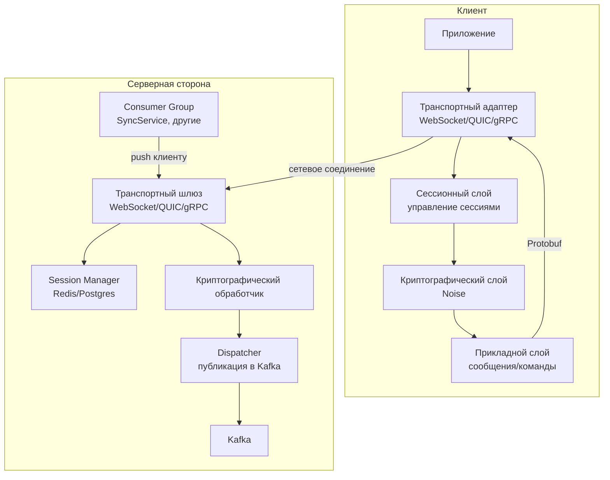

**Детальный план реализации нового протокола**, предназначенного для мессенджера, но с возможностью повторного использования в различных распределённых системах (IoT, финансовые транзакции, игровые серверы и т.д.). Протокол строится на принципах транспортной независимости, криптографической чистоты, нативной интеграции с Apache Kafka и модульности.

---

## 1. Цели и принципы протокола

- **Транспортная независимость** – один и тот же протокол может работать поверх WebSocket, QUIC, gRPC, обычных TCP-сокетов или даже надёжных каналов вроде SCTP.
- **Модульность** – уровни (транспорт, сессия, криптография, приложение) слабо связаны; их можно заменять/расширять.
- **Безопасность по умолчанию** – все соединения шифруются, используется современная криптография (Noise Protocol, X25519, ChaCha20-Poly1305, Sender Keys для групп).
- **Интеграция с Kafka** – сообщения естественным образом ложатся в топики, поддерживаются гарантии порядка, идемпотентность, масштабирование.
- **Наблюдаемость** – встроенная трассировка, структурированные логи, метрики.
- **Переиспользуемость** – ядро протокола (сессии, криптография, транспорт) отделено от бизнес-логики мессенджера, что позволяет адаптировать его для других доменов.

---

## 2. Общая архитектура



**Ключевые компоненты**:
- **Транспортный адаптер** – отвечает за установку и поддержание соединения (WebSocket, QUIC, gRPC stream).
- **Сессионный слой** – управляет идентификаторами сессий, привязкой к устройству, множественными соединениями на одну сессию.
- **Криптографический слой** – реализует установку ключей (Noise), шифрование/дешифрование пакетов, управление ключами для групп.
- **Dispatcher** – на сервере получает расшифрованные прикладные сообщения, преобразует их в универсальный формат и публикует в Kafka.
- **Consumer** – сервисы (например, SyncService) читают из Kafka, обрабатывают бизнес-логику (сохранение в базу, уведомления) и отправляют ответы клиентам через сессионный слой.

---

## 3. Транспортный уровень

### 3.1. Выбор транспорта
Поддерживаются три основных транспорта, каждый со своими преимуществами:

| Транспорт | Применение | Преимущества |
|-----------|------------|--------------|
| WebSocket | Браузеры, мобильные приложения | Широкая поддержка, простота, работа через firewalls |
| QUIC | Мобильные клиенты, высокоскоростные сети | 0-RTT, мультиплексирование, устойчивость к потере пакетов |
| gRPC (stream) | Микросервисная коммуникация, сервер‑сервер | Строгая типизация, поддержка потоков, интеграция с service mesh |

### 3.2. Формат фрейма
Все транспорты передают одинаковые **Protobuf‑сообщения**, обёрнутые в транспортный фрейм (например, WebSocket‑сообщение). Это позволяет единообразно обрабатывать данные на верхних уровнях.

```protobuf
message Frame {
  bytes session_id = 1;      // UUID сессии (обязателен)
  uint64 seq = 2;            // монотонный номер пакета в рамках сессии
  uint64 ack = 3;            // подтверждение полученного seq
  bytes encrypted_payload = 4; // шифрованная часть (криптослой)
}
```

### 3.3. Управление соединениями
- Клиент может открыть несколько транспортных соединений (например, одно для команд, одно для медиа) с одним и тем же `session_id`.
- Сервер поддерживает пул соединений на сессию, любое из них может использоваться для отправки сообщений клиенту (выбирается активное).
- При потере соединения клиент переподключается, но сессия остаётся активной (ключи продолжают действовать).

---

## 4. Сессионный уровень

### 4.1. Идентификация сессии
- Каждая сессия имеет уникальный `session_id` (UUID v4 или v7).
- При первом подключении клиент инициирует handshake (через криптографический слой) и получает `session_id` от сервера (или генерирует его сам, если используется асимметричная аутентификация).
- Сессия привязывается к **устройству** (а не к соединению). Это позволяет клиенту использовать несколько соединений параллельно.

### 4.2. Хранение состояния сессии
- На сервере состояние сессии (ключи, метаданные, список активных соединений) хранится в **Redis** (быстрый доступ) и дублируется в **PostgreSQL** для долговременного хранения (например, для восстановления после перезагрузки).
- Ключ: `session:<session_id>`.
- Поля: `user_id`, `device_id`, `crypto_state` (сериализованный объект Noise), `connections` (спок активных соединений с их типами и последним пакетом), `created_at`, `expires_at`.

### 4.3. Управление сессией
- **Аутентификация** выполняется один раз при создании сессии (например, через токен, полученный при входе). После этого все пакеты подписываются/шифруются с использованием установленного ключа.
- **Ротация ключей** – периодически (раз в несколько часов) стороны инициируют обновление ключей без разрыва сессии (Noise позволяет).
- **Таймаут** – если от клиента долго нет пакетов, сессия переводится в состояние «спящий», а через ещё больший интервал – удаляется.

---

## 5. Криптографический уровень

### 5.1. Установка ключей – Noise Protocol Framework
Выбран **Noise_XX_25519_ChaChaPoly_BLAKE2s**:
- **XX** – двусторонняя аутентификация (клиент и сервер имеют статические ключи).
- **25519** – X25519 для ECDH.
- **ChaChaPoly** – шифрование и аутентификация.
- **BLAKE2s** – хеш-функция.

Handshake:
1. Клиент отправляет `ephemeral public key`.
2. Сервер отвечает своим `ephemeral public key` + статический публичный ключ сервера (шифруется).
3. Клиент отправляет свой статический публичный ключ (шифруется) и завершает handshake.
В результате обе стороны имеют общий ключ шифрования и могут обмениваться защищёнными пакетами.

### 5.2. Формат зашифрованного payload
После handshake каждый `Frame.encrypted_payload` шифруется с использованием ключа сессии и счётчика `seq` в качестве nonce (или отдельного счётчика). Используется **ChaCha20-Poly1305** с 96-битным nonce.

### 5.3. Групповое end-to-end шифрование
Для групповых чатов применяется **Sender Keys** (аналогично Signal):
- Для каждой группы участник генерирует ключ рассылки (`sender_key`) и распространяет его среди участников через защищённые каналы.
- Сообщение шифруется один раз на группу (используя `sender_key`) и публикуется в Kafka. Все участники могут расшифровать, так как у них есть ключ.
- Регулярная ротация ключей для обеспечения forward secrecy.

### 5.4. Криптографическая гигиена
- Все временные ключи генерируются криптостойким генератором.
- Ключи хранятся в защищённой памяти (в коде – не логируются).
- Поддержка пост-компромиссной безопасности за счёт периодической ротации.

---

## 6. Прикладной уровень (сообщения и команды)

### 6.1. Универсальный формат сообщения
Все прикладные данные описываются в **Protobuf** и передаются внутри `Frame.encrypted_payload`. После расшифровки получаем:

```protobuf
message AppMessage {
  uint64 message_id = 1;       // глобальный UUIDv7 (сортировка по времени)
  uint64 timestamp = 2;
  oneof body {
    ChatMessage chat = 3;
    Command cmd = 4;
    MediaChunk media = 5;
    Ack ack = 6;
    Ping ping = 7;
    // ...
  }
}
```

### 6.2. Типы сообщений мессенджера
- **ChatMessage** – текстовое сообщение, реакция, удаление, редактирование.
- **Command** – создание чата, добавление участников, смена настроек.
- **MediaChunk** – фрагмент медиафайла (см. п. 7).
- **Ack** – подтверждение получения сообщения (для надёжности).
- **Ping/Pong** – проверка активности.

### 6.3. Маршрутизация через Kafka
- На сервере после расшифровки `AppMessage` поступает в **Dispatcher**.
- Dispatcher определяет топик Kafka:
  - Для личного сообщения – `user-<recipient_id>`.
  - Для группового – `group-<group_id>`.
  - Для команд – `commands` (отдельный топик).
- Партиционирование по ключу `recipient_id` или `group_id` гарантирует порядок сообщений в рамках чата/пользователя.

### 6.4. Outbox/Inbox шаблон
- При получении сообщения от клиента Dispatcher сначала сохраняет его в **Outbox** (шардированный PostgreSQL) – это даёт гарантию сохранности до публикации в Kafka.
- После успешной записи в Outbox, Dispatcher публикует сообщение в Kafka и отправляет клиенту **Ack**.
- Kafka‑потребители (например, SyncService) читают сообщения, обрабатывают их (сохраняют в Inbox получателей, обновляют индексы) и доставляют онлайн‑клиентам через сессионный слой.

---

## 7. Потоковая передача медиа

### 7.1. Отдельный канал
- Для загрузки больших файлов используется **отдельное транспортное соединение** (или мультиплексированный поток в QUIC/gRPC), чтобы не блокировать очередь команд.
- Клиент разбивает файл на чанки (например, 64 КБ) и отправляет их с типом `MediaChunk`, содержащим `stream_id`, `chunk_index`, `total_chunks`, `hash`.

### 7.2. Агрегация на сервере
- Шлюз получает чанки, агрегирует их во временном хранилище (например, в памяти + диск).
- После получения последнего чанка собирает файл, вычисляет хеш, сохраняет в S3‑совместимое хранилище и отправляет в Kafka мета‑сообщение с ссылкой на файл (для обычной доставки).

### 7.3. Потоковое видео/аудио
- Для стриминга используется отдельный протокол (например, WebRTC), но управляющие сигналы (начало/конец стрима) передаются через основной протокол.

---

## 8. Интеграция с Kafka: детали

### 8.1. Топики и партиции
- **user-<user_id>** – для личных сообщений, партиционирование по `user_id` (32 или 64 партиции на старте, затем можно увеличить).
- **group-<group_id>** – для групп.
- **commands** – для служебных команд, партиции по `command_type`.
- **events** – для аудита, метрик.

### 8.2. Гарантии доставки
- Используем **acks=all** и **min.insync.replicas=2** для надёжности.
- Для идемпотентности каждое сообщение имеет уникальный `message_id`. Потребители могут дедуплицировать на основе этого ID.

### 8.3. Синхронизация офлайн‑клиентов
- Каждый клиент при подключении отправляет `last_seen_message_id` (максимальный ID, который он получил).
- Session Manager подписывает соответствующий consumer на топик `user-<user_id>` с позиции, следующей за `last_seen_message_id` (используя `seek`).
- Таким образом, офлайн‑сообщения автоматически доставляются по мере подключения.

### 8.4. Масштабирование потребителей
- Группы потребителей (`SyncService`, `NotificationService` и т.д.) могут читать из одних и тех же топиков, каждый со своей логикой.
- Количество партиций определяет максимальный параллелизм. Рекомендуется закладывать 128–256 партиций для высоконагруженных топиков.

---

## 9. Переиспользование протокола для других систем

Протокол спроектирован так, чтобы его ядро (транспорт + сессии + криптография + базовая маршрутизация через Kafka) можно было использовать в различных доменах, просто заменив прикладной слой.

### 9.1. IoT (Интернет вещей)
- **Сценарий**: устройства передают телеметрию, получают команды управления.
- **Адаптация**:
  - Прикладной слой заменяется на `Telemetry` и `ControlCommand`.
  - Для экономии трафика можно использовать сжатие Protobuf.
  - Топики Kafka: `device-<device_id>` для сообщений от устройства, `command-<device_id>` для команд.
  - Аутентификация устройств может быть на основе сертификатов (интегрируется в Noise).

### 9.2. Финансовые транзакции
- **Сценарий**: передача ордеров, подтверждений, стриминг курсов.
- **Адаптация**:
  - Высокие требования к безопасности и аудиту. Криптослой остаётся.
  - Добавляется подпись сообщений для неотказуемости (например, Ed25519).
  - Топики Kafka: `orderbook-<instrument>`, `trade-<user_id>`.
  - Поддержка транзакционной семантики (Kafka transactions для атомарности).

### 9.3. Игровые серверы (real‑time multiplayer)
- **Сценарий**: обмен действиями игроков, синхронизация состояния.
- **Адаптация**:
  - Высокая частота сообщений, важна низкая задержка. Использовать QUIC или WebSocket с выделенными потоками.
  - Прикладной слой: `GameAction` (движения, выстрелы), `StateUpdate`.
  - Топики: `game-<game_id>`.
  - Возможно, отказ от Kafka для низкозадержных обновлений (использовать прямую рассылку через шлюзы), но для сохранения истории и аналитики Kafka остаётся.

### 9.4. Системы уведомлений
- **Сценарий**: push‑уведомления для мобильных приложений.
- **Адаптация**:
  - Сессионный слой может быть упрощён (не требуется множество соединений).
  - Прикладной слой: `Notification`.
  - Kafka топики: `notify-<user_id>`.

---

## 10. Этапы реализации (дорожная карта)

### Фаза 0: Исследование и прототипирование (1–2 месяца)
- Выбор технологий: Go/Rust/Java для сервера, Kotlin/Swift/JS для клиентов.
- Реализация базового Noise handshake и транспортного уровня (WebSocket).
- Прототип простого эхо‑сервера.

### Фаза 1: Ядро протокола (2–3 месяца)
- Реализация сессионного менеджера (Redis).
- Полноценная криптография (Noise, групповые ключи).
- Поддержка QUIC и gRPC как транспортов.
- Написание клиентских SDK с абстракцией транспорта.

### Фаза 2: Интеграция с Kafka (2–3 месяца)
- Реализация Dispatcher и публикация в Kafka.
- Создание SyncService – потребителя, сохраняющего сообщения в PostgreSQL (Inbox).
- Настройка партиционирования и репликации.
- Поддержка офлайн‑синхронизации.

### Фаза 3: Медиа и расширенные функции (2–3 месяца)
- Потоковая передача файлов (чанкинг, агрегация, S3).
- Поддержка групповых чатов с Sender Keys.
- Добавление команд и административных функций.

### Фаза 4: Наблюдаемость, отказоустойчивость, тестирование (2 месяца)
- Интеграция OpenTelemetry (трассировка, метрики).
- Нагрузочное тестирование (k6, JMeter).
- Документирование протокола (OpenAPI для gRPC/HTTP).

### Фаза 5: Адаптация для других систем (параллельно)
- Выделение ядра в отдельную библиотеку/модуль.
- Создание примеров использования для IoT, финансов, игр.
- Публикация спецификации протокола (например, в виде Protobuf).

---

## 11. Технологический стек и примеры кода

### Серверная сторона
- **Язык**: Go (высокая производительность, хорошая поддержка сетевых протоколов) или Rust (если нужна максимальная безопасность и производительность). Для прототипа – Go.
- **Транспорты**: 
  - WebSocket: `gorilla/websocket`
  - QUIC: `quic-go`
  - gRPC: стандартная библиотека gRPC‑Go
- **Криптография**: библиотека `noise` для Go (например, `flynn/noise`).
- **Kafka**: `segmentio/kafka-go` или `confluent-kafka-go`.
- **Хранилища**: Redis (сессии), PostgreSQL (Outbox/Inbox, метаданные), S3 (медиа).

### Клиентские SDK
- **iOS**: Swift, `Starscream` для WebSocket, CryptoKit.
- **Android**: Kotlin, OkHttp, `noise-java`.
- **Web**: TypeScript, `socket.io` или нативный WebSocket, библиотека `noise-c.wasm`.

### Пример: публикация сообщения в Kafka (Go)

```go
func (d *Dispatcher) Publish(msg *AppMessage) error {
    var topic string
    var key []byte

    switch m := msg.Body.(type) {
    case *AppMessage_Chat:
        if m.Chat.GroupId != nil {
            topic = fmt.Sprintf("group-%s", m.Chat.GroupId)
            key = m.Chat.GroupId
        } else {
            topic = fmt.Sprintf("user-%s", m.Chat.RecipientId)
            key = m.Chat.RecipientId
        }
    // ... другие типы
    }

    // Сериализуем AppMessage в Protobuf
    data, err := proto.Marshal(msg)
    if err != nil {
        return err
    }

    // Публикуем в Kafka
    return d.producer.Produce(context.Background(), &kafka.Message{
        Topic: &topic,
        Key:   key,
        Value: data,
    }, nil)
}
```

---

## 12. Заключение

Предложенный протокол даёт **гибкую, безопасную и масштабируемую основу** для мессенджера, интегрированную с Kafka, и при этом легко адаптируется под другие классы приложений. Ключевые преимущества:

- **Транспортная независимость** – один протокол работает поверх WebSocket, QUIC, gRPC.
- **Современная криптография** – Noise Protocol для сессий, Sender Keys для групп, идемпотентность.
- **Нативная поддержка Kafka** – естественное партиционирование, outbox/inbox, офлайн‑синхронизация.
- **Модульность** – ядро протокола может быть переиспользовано в IoT, финансах, играх.
- **Наблюдаемость** – встроенная трассировка и метрики.

Реализация по этапам позволяет начать с минимально жизнеспособного продукта (WebSocket + Noise + простой Dispatcher) и постепенно наращивать функциональность, сохраняя возможность адаптации для других систем.